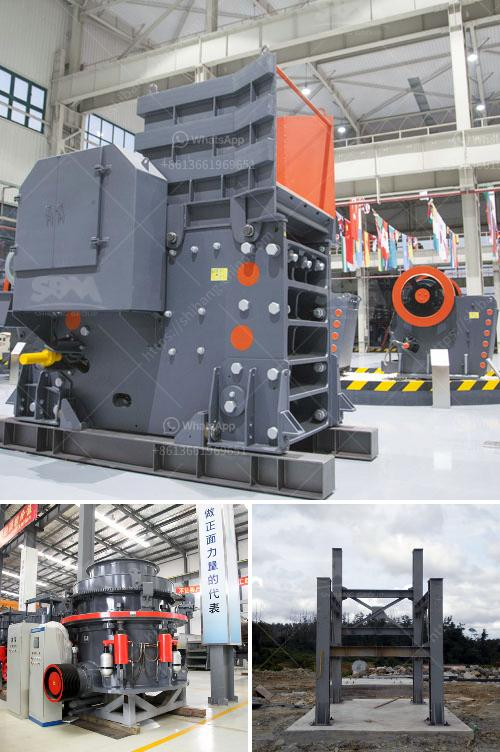

<h3>crawler type mobile crushers</h3>
Crawler-type mobile crushers are designed for unfixed mining, quarrying, construction sites, highly polluted fields, and many other harsh environments. To meet the specific needs of different customers, crawler-type mobile crushers are equipped with different crushing and screening equipment. These machines are widely used in mining, metallurgy, construction, highways, railways, water conservancy, and chemical industries.

One of the key advantages of crawler-type mobile crushers is their excellent mobility. Compared to traditional crushers, crawler-type mobile crushers can be driven directly to the site, eliminating the need for transportation and saving fuel costs. In addition, the compact design allows these crushers to be easily transported and set up in a short period of time.

Crawler-type mobile crushers are also highly efficient in terms of crushing material to a specific size. This enhances the overall productivity of the equipment, as it reduces the downtime of the machinery due to oversize material. Furthermore, the integrated hydraulic system ensures easy and quick adjustments, making it easier to control the size of the final product.

Another advantage of crawler-type mobile crushers is their high adaptability. These machines can handle various types of materials, from hard rock to recycled materials. With different attachments such as jaw crusher, cone crusher, and impact crusher, the crawler-type mobile crushers can process both coarse and fine materials.

In conclusion, crawler-type mobile crushers are versatile machines that offer high mobility, efficient crushing capabilities, and excellent adaptability. Whether it is for mining, quarrying, construction, or any other field, these crushers are designed to deliver superior performance even in the harshest environments.
<h3>Contact us</h3><ul><li><strong>Whatsapp:&nbsp;<a href="https://wa.me/8613661969651">+8613661969651</a></strong></li><li><a href="https://swt.shibang-china.com/?git&amp;zhl&amp;crawler type mobile crushers"><strong>Online Service(chat now)</strong></a></li></ul><h3>Related</h3><ul><li><a href='washing powder production line.md'>washing powder production line</a></li><li><a href='crusher for crushing ore in gold mining plant.md'>crusher for crushing ore in gold mining plant</a></li><li><a href='quartz plant machinery suppliers in china.md'>quartz plant machinery suppliers in china</a></li><li><a href='equipment used in quarry crusher.md'>equipment used in quarry crusher</a></li><li><a href='quarry equipment prices.md'>quarry equipment prices</a></li></ul>