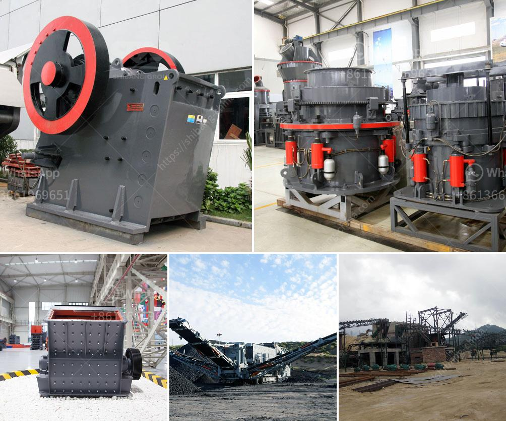

<h3>crush molybdenum equipment</h3>
Crushing is a fundamental process in mining and mineral processing industries, where the primary objective is to reduce the size of the ore for further processing. Crush Molybdenum Equipment is an essential tool used in this process, specifically designed and engineered to handle the unique properties and requirements of molybdenum ore.

Molybdenum is a silvery-white transition metal that has excellent high-temperature and corrosion-resistant properties. It is mainly used in the production of high-strength steel alloys, as a catalyst in the petroleum industry, and in the production of chemicals and electronics. However, before it can be utilized in these applications, molybdenum ore must be extracted from the earth and processed into a purer form with the desired particle size.

Crush Molybdenum Equipment plays a crucial role in the extraction and processing of molybdenum ore. This specialized equipment is designed to break down rocks and ores into smaller, more manageable sizes, making it easier to extract the valuable minerals. It typically consists of a heavy-duty crusher, such as a jaw crusher or cone crusher, along with a vibrating screen, conveyor belts, and other supporting equipment.

One of the key challenges in crushing molybdenum ore is its brittleness. Molybdenum tends to break along grain boundaries, which makes the crushing process more challenging and requires specialized equipment. Crush Molybdenum Equipment is specifically designed to handle this brittleness, ensuring efficient and effective crushing of the ore while minimizing damage and loss of valuable mineral content.

The choice of crusher type and design is critical in achieving the desired particle size reduction. Jaw crushers are often used as primary crushers in molybdenum crushing circuits, capable of handling large feed sizes and producing a wide range of particle sizes. Cone crushers, on the other hand, are typically used as secondary or tertiary crushers, providing finer particle size reduction. They are especially well-suited for reducing the size of molybdenum ore to meet the specifications of downstream processes.

Another important factor in Crush Molybdenum Equipment design is the maintenance and operational requirements. Molybdenum crushing circuits operate in harsh environments with high dust levels, vibrations, and heavy loads. Therefore, the equipment must be robust, durable, and easy to maintain. Regular inspection, maintenance, and replacement of wear parts are crucial to ensure optimal performance and minimize downtime.

In conclusion, Crush Molybdenum Equipment is a specialized tool that plays a crucial role in the extraction and processing of molybdenum ore. Designed to handle the brittleness of molybdenum and meet the unique requirements of the industry, this equipment ensures efficient and effective crushing, reducing the ore's size and preparing it for further processing. With the right choice of equipment and proper maintenance, Crush Molybdenum Equipment contributes to the production of high-quality molybdenum products for various industries, ultimately driving economic growth and technological advancements.
<h3>Contact us</h3><ul><li><strong>Whatsapp:&nbsp;<a href="https://wa.me/8613661969651">+8613661969651</a></strong></li><li><a href="https://swt.shibang-china.com/?git&amp;zhl&amp;crush molybdenum equipment"><strong>Online Service(chat now)</strong></a></li></ul><h3>Related</h3><ul><li><a href='vsi crusher machine.md'>vsi crusher machine</a></li><li><a href='howhow to set up a stone crushing business.md'>howhow to set up a stone crushing business</a></li><li><a href='hammer mill in nigeria.md'>hammer mill in nigeria</a></li><li><a href='used grinding mills in nigeria.md'>used grinding mills in nigeria</a></li><li><a href='turkish manufacturer belt conveyor.md'>turkish manufacturer belt conveyor</a></li></ul>