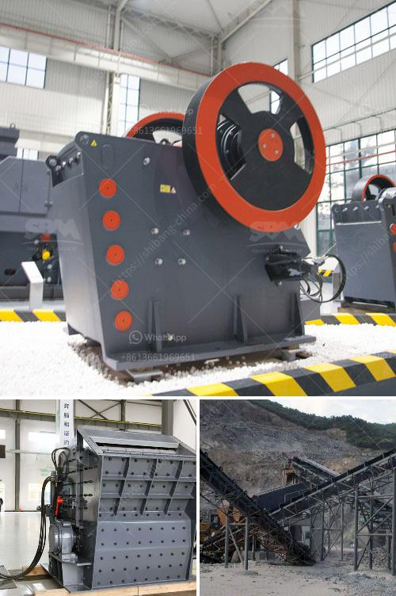

<h3>crushed price impact crusher price</h3>
Crushing equipment plays a crucial role in various industries, such as mining, construction, and recycling. Impact crushers, in particular, have gained immense popularity due to their ability to crush materials with high efficiency and effectiveness. In recent years, the market has witnessed a substantial drop in the prices of impact crushers, making them more accessible to a wider range of customers. This article explores the reasons behind this plummet in prices and the opportunities it presents for industries across the globe.

The drop in impact crusher prices can be attributed to several key factors. Firstly, advancements in manufacturing technology have enabled manufacturers to streamline their production processes, resulting in cost savings. Additionally, increased competition among manufacturers has spurred price competition, forcing them to offer more competitive prices to attract customers. Furthermore, the growing demand for impact crushers has led to economies of scale, allowing manufacturers to lower their production costs.

The reduction in impact crusher prices brings forth several benefits for customers. Firstly, it enables smaller businesses and startups to afford this essential crushing equipment, empowering them to compete in their respective industries. Moreover, the affordability of impact crushers opens up new possibilities for industries to enhance their productivity and efficiency. The accessibility of these machines allows for easier upgrading and replacement of outdated and inefficient equipment, leading to improved operations and overall cost savings.

Another significant advantage of the decreased prices of impact crushers is the positive environmental impact. These machines are often used in recycling operations to process and crush various materials, including concrete and asphalt. By making these crushers more affordable, companies are encouraged to invest in recycling processes, thereby reducing the environmental impact associated with material disposal. The use of impact crushers in recycling not only minimizes waste but also contributes to the conservation of natural resources.

With the drop in impact crusher prices, industries can expect a surge in demand for these machines. This presents a golden opportunity for manufacturers to expand their businesses and increase their market share. Manufacturers could focus on enhancing the quality and technological features of their impact crushers, ensuring they meet the growing demand while offering a competitive edge. Furthermore, the decline in prices can also lead to innovation and the development of more versatile and efficient impact crushers that cater to a wide range of specific industry needs.

The significant drop in impact crusher prices signifies a positive development for various industries. Not only does it make this essential equipment more accessible to a broader customer base, but it also encourages companies to invest in sustainable practices such as recycling. Manufacturers, in turn, should capitalize on this opportunity by continuously improving their products, thus solidifying their position in the market. The crushed prices of impact crushers pave the way for enhanced productivity, reduced environmental impact, and numerous possibilities for businesses across the globe.
<h3>Contact us</h3><ul><li><strong>Whatsapp:&nbsp;<a href="https://wa.me/8613661969651">+8613661969651</a></strong></li><li><a href="https://swt.shibang-china.com/?git&amp;zhl&amp;crushed price impact crusher price"><strong>Online Service(chat now)</strong></a></li></ul><h3>Related</h3><ul><li><a href='price of a stone crusher machine in zambia.md'>price of a stone crusher machine in zambia</a></li><li><a href='limestone grinding roller mill.md'>limestone grinding roller mill</a></li><li><a href='second hand conveyor belt adelaide.md'>second hand conveyor belt adelaide</a></li><li><a href='sand washing system.md'>sand washing system</a></li><li><a href='stone crushing machines in canada.md'>stone crushing machines in canada</a></li></ul>