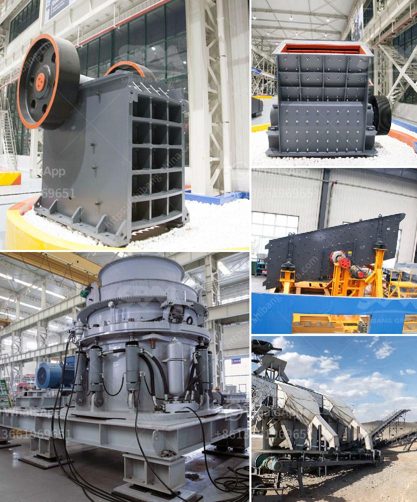

<h3>crusher and screening plant</h3>
Crushers and screening plants play a crucial role in construction and mining projects. They enable the efficient processing of materials, ensuring that industries can meet their production targets and deliver high-quality products. These machines are essential for the handling of various materials, including rocks, minerals, and ores, making them a vital component in many industries.

A crusher is a machine designed to break down large rocks into smaller, more manageable pieces. It utilizes mechanical force to compress, impact, or shear the materials into smaller sizes. Crushers are commonly used in construction, mining, and recycling industries. They are available in different types, such as jaw crushers, gyratory crushers, cone crushers, and impact crushers. Each type serves a specific purpose and is suitable for different applications.

On the other hand, screening plants are used to separate different-sized materials. They are typically used after the crushing process to classify and sort the materials based on their size. Screening plants consist of a vibrating screen or a series of screens, which help in the separation of oversized materials, undersized materials, and the desired product. They are crucial in reducing the loading of crushers and ensuring that only the correctly sized materials undergo further processing.

The combination of crushers and screening plants in a crushing and screening plant offers several advantages. Firstly, it allows for the efficient processing of materials from raw rock to finished product, all in one location. This eliminates the need for multiple machines and saves both time and money. Additionally, using a screening plant after the crushing process ensures that only the desired material goes further in the production line, improving overall productivity.

Crushing and screening plants are widely used in the construction industry for road building, highway construction, and concrete production. They are also essential in the mining industry, where they are used to process ores and extract valuable minerals. Moreover, these plants are used in the recycling industry to crush and repurpose materials like concrete, asphalt, and demolition waste.

When selecting a crusher and screening plant, several factors need to be considered. The type and size of the materials being processed should match the capabilities of the machines. The machinery should be durable and reliable to withstand the harsh conditions of the working environment. Additionally, ease of maintenance, energy efficiency, and cost-effectiveness should also be taken into account.

With advancements in technology, crushers and screening plants have become more efficient and environmentally friendly. Many modern machines incorporate features like automatic control systems, remote monitoring, and computer simulations to optimize performance and minimize downtime. There is also a growing trend towards the use of electric or hybrid-powered machinery, reducing emissions and reliance on fossil fuels.

In conclusion, crushers and screening plants are integral to the construction, mining, and recycling industries. They enable the efficient processing of materials, ensuring optimal productivity and high-quality products. Advances in technology continue to improve the capabilities and environmental friendliness of these machines. As industries continue to evolve, the need for efficient and reliable crushers and screening plants will only increase.
<h3>Contact us</h3><ul><li><strong>Whatsapp:&nbsp;<a href="https://wa.me/8613661969651">+8613661969651</a></strong></li><li><a href="https://swt.shibang-china.com/?git&amp;zhl&amp;crusher and screening plant"><strong>Online Service(chat now)</strong></a></li></ul><h3>Related</h3><ul><li><a href='stone crushing machines for sale in philippines.md'>stone crushing machines for sale in philippines</a></li><li><a href='the price of a ball mill in india.md'>the price of a ball mill in india</a></li><li><a href='china gold stamp mills for sale in south africa.md'>china gold stamp mills for sale in south africa</a></li><li><a href='business plan for stone crushing plant pdf.md'>business plan for stone crushing plant pdf</a></li><li><a href='crushing roller mill japan.md'>crushing roller mill japan</a></li></ul>