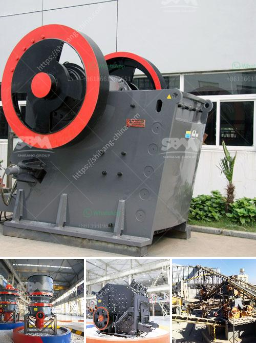

<h3>crusher corpses crusher company</h3>
In the world of heavy machinery and construction, one name stands out for its unrivaled expertise in crushers and crushing equipment - Crusher Corps. With a solid foundation since its establishment, Crusher Corps has emerged as a leading player in the industry, providing high-quality solutions to its clients. 

The company's success can be attributed to its cutting-edge technology, exceptional customer service, and a highly skilled workforce. Crusher Corps has mastered the art of engineering crushers that efficiently break down rock, concrete, and other materials, making them a vital asset in various industries such as mining, construction, and recycling. 

One of the key strengths of Crusher Corps is its ability to tailor solutions to individual client needs. By conducting thorough research, understanding the specific project requirements, and utilizing their expertise, the company delivers customized machinery that exceeds expectations. Whether it's a small-scale project or a large industrial undertaking, Crusher Corps has the right crusher for the job. 

Furthermore, Crusher Corps places a strong emphasis on customer satisfaction. The company believes in building lasting relationships with its clients by providing exceptional service, timely maintenance, and prompt delivery of spare parts. This commitment has earned them a loyal clientele that trusts and relies on Crusher Corps for their crushing needs. 

Moreover, Crusher Corps understands the importance of sustainability and environmental responsibility. The company prioritizes eco-friendly practices, focusing on minimizing waste and reducing the carbon footprint associated with their operations. By incorporating energy-efficient technology and exploring innovative solutions, Crusher Corps remains at the forefront of environmentally conscious manufacturing. 

In conclusion, Crusher Corps has established itself as a reputable and reliable player in the crusher manufacturing industry. Its cutting-edge technology, commitment to customer service, and dedication to sustainability set it apart from its competitors. With an ever-expanding portfolio of successful projects, Crusher Corps continues to crush obstacles and pave the way for a more efficient and sustainable future in construction and mining.
<h3>Contact us</h3><ul><li><strong>Whatsapp:&nbsp;<a href="https://wa.me/8613661969651">+8613661969651</a></strong></li><li><a href="https://swt.shibang-china.com/?git&amp;zhl&amp;crusher corpses crusher company"><strong>Online Service(chat now)</strong></a></li></ul><h3>Related</h3><ul><li><a href='crusher stone crusher de rio stone.md'>crusher stone crusher de rio stone</a></li><li><a href='single super phosphate plants in germany.md'>single super phosphate plants in germany</a></li><li><a href='used ball mill in gujrat.md'>used ball mill in gujrat</a></li><li><a href='sand vsi crusher.md'>sand vsi crusher</a></li><li><a href='small sized cement plant project cost in india.md'>small sized cement plant project cost in india</a></li></ul>