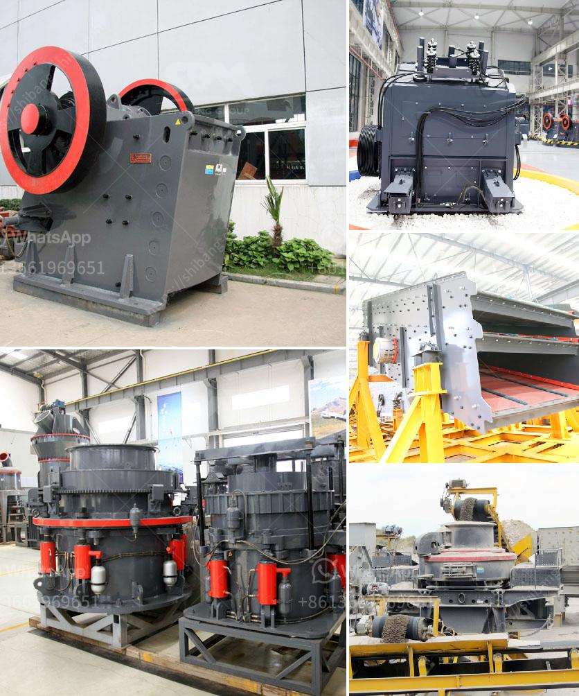

<h3>crusher for crushed stone 110 price</h3>
When it comes to construction projects, one of the key materials used is crushed stone. This versatile material is widely used in various applications, including road base, drainage, concrete aggregates, and landscaping. As demand for crushed stone continues to rise, construction companies are constantly on the lookout for cost-effective solutions. This is where the crusher for crushed stone 110 price comes into play, offering a reliable and affordable solution for construction projects.

Crushed stone is produced by passing large rocks through a crusher machine, which breaks them down into various sizes. The crusher machine plays a crucial role in ensuring the desired size and quality of crushed stone is achieved. With the advancement of technology, crushers have become more efficient, resulting in cost savings for construction companies.

The crusher for crushed stone 110 price stands out in terms of affordability, making it an attractive choice for small to medium-sized construction companies with budget constraints. Priced at an affordable level, this crusher offers a cost-effective solution without compromising on performance and quality.

One of the key advantages of the crusher for crushed stone 110 price is its robust design and durability. Built to withstand heavy-duty operations, this machine can handle large volumes of rocks and stones without any issues. Its powerful motor and strong jaw plates ensure efficient crushing and high productivity. Construction companies can rely on this crusher to consistently deliver the desired results, reducing the risk of project delays or material shortages.

Furthermore, the crusher for crushed stone 110 price is designed with ease of use in mind. It features a user-friendly control panel that allows operators to adjust the settings and monitor the crushing process. This makes it convenient for construction companies to train their staff quickly and efficiently, ensuring optimal productivity from day one.

Additionally, this crusher offers a wide range of choices in terms of crushed stone sizes. It can produce various sizes of crushed stone, ranging from 1/2 inch to 2 inches, depending on the specific requirements of the project. This versatility allows construction companies to use the crushed stone for different applications, eliminating the need to invest in multiple crushers or screening equipment.

In conclusion, the crusher for crushed stone 110 price is a cost-effective solution for construction projects. With its affordability, durability, and ease of use, it offers construction companies a reliable and efficient way to produce high-quality crushed stone. Whether it is for road base, drainage, concrete aggregates, or landscaping, this crusher can deliver consistent results, ensuring the success of construction projects. Investing in this crusher can significantly lower construction costs, making it a wise choice for companies looking to maximize their budget while maintaining quality.
<h3>Contact us</h3><ul><li><strong>Whatsapp:&nbsp;<a href="https://wa.me/8613661969651">+8613661969651</a></strong></li><li><a href="https://swt.shibang-china.com/?git&amp;zhl&amp;crusher for crushed stone 110 price"><strong>Online Service(chat now)</strong></a></li></ul><h3>Related</h3><ul><li><a href='5 micron grinding mill.md'>5 micron grinding mill</a></li><li><a href='marble crusher supplier.md'>marble crusher supplier</a></li><li><a href='belt conveyor cost per meter of installation.md'>belt conveyor cost per meter of installation</a></li><li><a href='rental mobile stone crusher machine in malaysia.md'>rental mobile stone crusher machine in malaysia</a></li><li><a href='marble stone powder manufacturer in pakistan.md'>marble stone powder manufacturer in pakistan</a></li></ul>