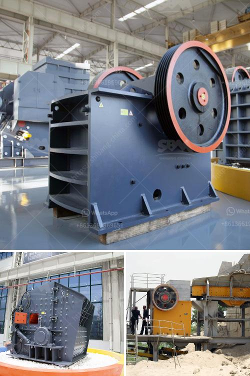

<h3>crusher for crushing ore in gold mining plant</h3>
The gold mining process is complex and requires meticulous planning and a deep understanding of the industry. With the steady depletion of natural resources, demand for precious metals like gold is on the rise. To meet this demand, mining companies are investing in mining equipment, focusing on better efficiency and productivity.

In any mining operation, the primary task is to extract the valuable minerals from the ore. To achieve this, several stages are involved, such as blasting, milling, and flotation. However, one of the most crucial steps is crushing the ore. A crusher plays a key role in this process.

A crusher is a mechanical device specifically designed to take large rocks and reduce them to smaller rocks, gravel, or rock dust. Crushers are utilized in various mining operations for various purposes, ranging from primary crushing to fine crushing, depending on the size and configuration.

When it comes to gold ore, crushers are widely used. In gold mining plants, it is not uncommon to find crushers in two or even three stages of crushing. Primary crushers are usually jaw crushers, while secondary and tertiary crushers are typically cone crushers or impact crushers.

The primary crusher is responsible for reducing the size of the ore into smaller, more manageable pieces or lumps for further processing. It is designed to achieve maximum productivity and high reduction ratio. In many cases, the primary crusher is situated at the pit's edge. This allows for easier transportation of the ore to the processing plant.

The secondary crusher is responsible for further reducing the size of the ore to the desired size for downstream processing. It plays a critical role in ensuring uniformity and consistency in the final product. The secondary crusher can be a cone crusher or an impact crusher, depending on the hardness of the ore and the desired particle size.

Lastly, the tertiary crusher is mainly used for fine crushing, producing smaller-sized particles suitable for flotation or leaching processes. This stage is crucial in achieving the desired gold recovery rate and preparing the ore for further processing.

In addition to size reduction, crushers also play a significant role in controlling the particle shape and grading. A well-designed crusher can produce uniform, cubical particles that are suitable for downstream processes, minimizing the need for additional crushing or grinding.

When selecting a crusher for gold mining plants, several factors should be considered. These include the ore's properties, such as hardness and abrasiveness, as well as the desired particle size and the plant's production requirements. Additionally, factors like maintenance and operational costs, energy consumption, and crusher availability should also be taken into account.

In conclusion, crushers are essential equipment in the gold mining industry. They perform the critical task of reducing the size of the ore, making it suitable for further processing. Selecting the right crusher for the job is vital to ensure optimal efficiency, productivity, and gold recovery rates. With proper planning and investment in state-of-the-art crushers, gold mining plants can maximize their ore-processing capabilities and meet the increasing demand for this precious metal.
<h3>Contact us</h3><ul><li><strong>Whatsapp:&nbsp;<a href="https://wa.me/8613661969651">+8613661969651</a></strong></li><li><a href="https://swt.shibang-china.com/?git&amp;zhl&amp;crusher for crushing ore in gold mining plant"><strong>Online Service(chat now)</strong></a></li></ul><h3>Related</h3><ul><li><a href='ultrafine grinding mill.md'>ultrafine grinding mill</a></li><li><a href='accounting entry on crushing plant.md'>accounting entry on crushing plant</a></li><li><a href='sand crusher machine price at india.md'>sand crusher machine price at india</a></li><li><a href='stone crusher manufactured in new zealand.md'>stone crusher manufactured in new zealand</a></li><li><a href='andhra pradesh coal crusher equipment price.md'>andhra pradesh coal crusher equipment price</a></li></ul>