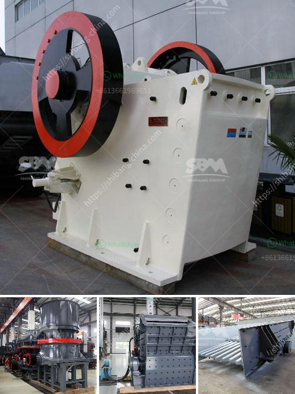

<h3>crusher for dolomite</h3>
Dolomite is a mineral that has a chemical formula of CaMg(CO3)2. Dolomite is commonly found in nature and is used in many industrial applications, including construction, steel manufacturing, agricultural fertilizer production, and more. Dolomite is also highly valued for its use as an ornamental stone due to its beautiful appearance and unique properties.

To process dolomite, the first step is to crush it into small particles, which are then used as a raw material in various industries. The crushing process involves the use of a crusher, which breaks the dolomite into smaller pieces. In its pure form, dolomite has a white color, but it is often mixed with impurities, such as clay, silt, sand, or iron, which give it a yellow, brown, or gray color.

Crushers are used in the crushing process to reduce the size of dolomite particles and facilitate easy processing. For instance, crushers are used to break down the dolomite into manageable sizes such as 5-10 millimeters. Crushers are also used to extract and remove the impurities from dolomite particles. This is done by crushing the dolomite and then passing it through a series of sieves and filters to separate the impurities from the valuable dolomite particles.

There are various types of crushers that can be used to crush dolomite, including jaw crushers, cone crushers, impact crushers, and more. The choice of the crusher depends on the size and hardness of the dolomite, as well as the desired output size. Jaw crushers are commonly used as primary crushers due to their ability to crush hard and abrasive materials. Cone crushers are best suited for secondary crushing, as they are particularly effective in processing more abrasive materials.

Impact crushers, on the other hand, are used for tertiary crushing due to their ability to produce finely crushed dolomite and adjust to a desired end product size. Impact crushers are also widely used in the quarrying and mining industries, as they can handle larger feed sizes and produce high-quality final products. Additionally, some crushers have the option of adjustable settings, allowing operators to optimize the crushing process based on the desired final product.

The application of crushers in the dolomite crushing process not only improves productivity and efficiency but also reduces operational costs. Crushers are designed to handle a wide range of materials and can be customized to suit specific processing requirements. This flexibility allows operators to process dolomite with different characteristics, such as varying sizes and levels of impurities.

In conclusion, crushers play an essential role in the processing of dolomite. They are used to crush dolomite into smaller particles and remove impurities, facilitating the production of high-quality dolomite products. The choice of crusher depends on the size and hardness of the dolomite, as well as the desired output size. Crushers offer flexibility and efficiency, allowing operators to customize the crushing process to meet specific requirements. By utilizing crushers, industries can optimize their dolomite processing and enhance overall productivity and profitability.
<h3>Contact us</h3><ul><li><strong>Whatsapp:&nbsp;<a href="https://wa.me/8613661969651">+8613661969651</a></strong></li><li><a href="https://swt.shibang-china.com/?git&amp;zhl&amp;crusher for dolomite"><strong>Online Service(chat now)</strong></a></li></ul><h3>Related</h3><ul><li><a href='equipment used in iron ore beneficiation.md'>equipment used in iron ore beneficiation</a></li><li><a href='price limestone crusher for sale.md'>price limestone crusher for sale</a></li><li><a href='density of crushed hornfels basalt granite.md'>density of crushed hornfels basalt granite</a></li><li><a href='small bleaching powder manufacturing plant project report.md'>small bleaching powder manufacturing plant project report</a></li><li><a href='impact crushing machine price.md'>impact crushing machine price</a></li></ul>