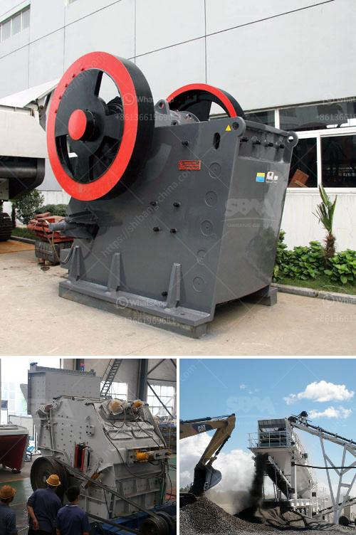

<h3>crusher for limestone</h3>
Limestone is a sedimentary rock that is composed of calcium carbonate minerals (such as calcite) and skeletal fragments of marine organisms. Limestone deposits can be found in various parts of the world, and they are formed over millions of years under the pressure of rock formations and marine life.

Limestone has numerous applications in various industries due to its versatility, strength, and durability. It is commonly used as a base material in road construction, as an aggregate in concrete production, as a raw material in cement manufacturing, and as a flux in steel production, among other things. With its high demand, the need for efficient crushers to process limestone has become ever more urgent.

One of the most common types of crushers used in mining and quarrying industry is the primary jaw crusher. This machine is typically used in mines or quarries that have a high capacity requirement, and it usually operates in the first stage of the crushing process. Regardless of the type of limestone, jaw crushers are important to help achieve the desired end product.

As a primary crusher, jaw crushers are more widely used due to their ability to process larger chunks of limestone. Jaw crushers are also known as "rock breakers" and are used to break up larger, harder materials into more manageable pieces. They tend to do well with many different types of materials and don't display as much wear and tear as impact crushers.

In addition to jaw crushers, another commonly used equipment in the mining and quarrying industry is the impact crusher. Impact crushers use an aggressive force to break up limestone. When the material enters the blow bar area, it collides with the high-speed rotating blow bar and is crushed into small pieces.

Impact crushers are ideal for producing large volumes of fractionated limestone dust, fine aggregate, or ready-mixed concrete. However, they are not suitable for processing hard rock or abrasive materials.

Furthermore, cone crushers are also commonly used in the mining and quarrying industry to crush hard rock and various minerals. These machines work by compressing the material between an eccentrically rotating mantle and a concave bowl liner. The crushed material is then discharged through an adjustable gap at the bottom. Cone crushers are highly efficient for crushing limestone, as they can process large amounts of material in a relatively short amount of time.

Choosing the appropriate crusher for limestone processing is crucial in ensuring desired end products. Each type of crusher is different and used to achieve specific results. It's important to consider factors such as rock hardness, required output, and wear resistance of the machinery being used.

In conclusion, crushers for limestone play an important role in the mining and construction industry. With high demand and constant advancements in technology, selecting the right crusher is essential for successful operation. Whether it's jaw crushers, impact crushers, or cone crushers, choosing the right machine for your operation will ensure efficient production and maximum profitability.
<h3>Contact us</h3><ul><li><strong>Whatsapp:&nbsp;<a href="https://wa.me/8613661969651">+8613661969651</a></strong></li><li><a href="https://swt.shibang-china.com/?git&amp;zhl&amp;crusher for limestone"><strong>Online Service(chat now)</strong></a></li></ul><h3>Related</h3><ul><li><a href='calculation coal crusher.md'>calculation coal crusher</a></li><li><a href='ultra fine grinding mill price.md'>ultra fine grinding mill price</a></li><li><a href='cone crusher middle east.md'>cone crusher middle east</a></li><li><a href='distributor crusher di indonesia.md'>distributor crusher di indonesia</a></li><li><a href='jaw crusher in algeria.md'>jaw crusher in algeria</a></li></ul>