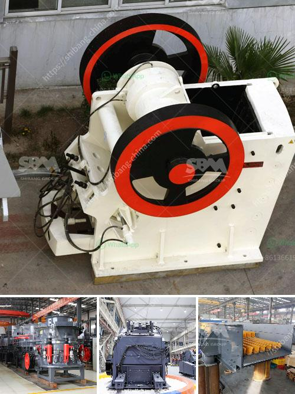

<h3>crusher for silica</h3>
Crushing materials such as stones, gravel, or even sand is essential in many industries. Not only does it reduce the size of the particles, but it also creates a more uniform product, facilitating further processing. When it comes to crushing silica, a specific type of crusher is required to handle the abrasive nature of this mineral. In this article, we will explore the importance of crushers for silica and discuss the features and benefits of using them.

Silica, also known as silicon dioxide, is the second most abundant mineral in the Earth's crust after quartz. It is a major component of sand, rock, and mineral ores. Silica possesses excellent hardness and is highly resistant to wear and tear. However, due to its tough nature, it requires a robust crushing solution to break it down efficiently.

The crusher commonly used for crushing silica is the jaw crusher. This primary crusher operates by applying pressure to the material between two jaws, one stationary and one movable. The movable jaw exerts force on the rock by pressing it against the stationary jaw until it breaks down into smaller pieces.

One of the significant advantages of a jaw crusher for silica is its ability to handle large feed sizes. Jaw crushers can accept materials up to 2 meters in size, allowing them to be used for primary crushing stages. With their large feed openings and strong jaws, they can easily handle the abrasive nature of silica without any risk of damage or wear.

Another crucial benefit of jaw crushers for silica is their versatility. These crushers come in various sizes and models, enabling operators to choose the one that best suits their specific needs. Whether it is a small-scale operation or a large industrial plant, a jaw crusher can be tailored to meet the production requirements.

Furthermore, jaw crushers offer excellent efficiency and productivity. They are designed to crush materials quickly and efficiently, reducing the time required for crushing operations. This enhances overall productivity and helps meet demanding schedules. Additionally, jaw crushers are known for their low maintenance requirements, reducing downtime and increasing operational efficiency.

In addition to jaw crushers, other types of crushers can also be used for silica crushing. For example, impact crushers generate high-speed impact forces to crush the material, while cone crushers operate by squeezing the material between an eccentrically rotating mantle and a concave surface. These crushers can be an alternative for specific applications or specific product sizes.

In conclusion, the crushing of silica is a critical process in various industries, and choosing the right crusher is essential to ensure efficiency, productivity, and a high-quality final product. Jaw crushers are commonly used for silica crushing due to their ability to handle large feed sizes, versatility, and high efficiency. Furthermore, their low maintenance requirements make them a cost-effective solution. However, depending on specific requirements, other types of crushers like impact crushers and cone crushers can also be utilized effectively. Regardless of the crusher chosen, it is crucial to prioritize safety measures and follow proper maintenance and operational procedures to ensure optimum performance and prolong the life of the equipment.
<h3>Contact us</h3><ul><li><strong>Whatsapp:&nbsp;<a href="https://wa.me/8613661969651">+8613661969651</a></strong></li><li><a href="https://swt.shibang-china.com/?git&amp;zhl&amp;crusher for silica"><strong>Online Service(chat now)</strong></a></li></ul><h3>Related</h3><ul><li><a href='machine to make dolomite powder.md'>machine to make dolomite powder</a></li><li><a href='industrial ball mill.md'>industrial ball mill</a></li><li><a href='iron ore crusher plant.md'>iron ore crusher plant</a></li><li><a href='ultrafine grinding mill.md'>ultrafine grinding mill</a></li><li><a href='alluvial gold processing plant for small scale.md'>alluvial gold processing plant for small scale</a></li></ul>