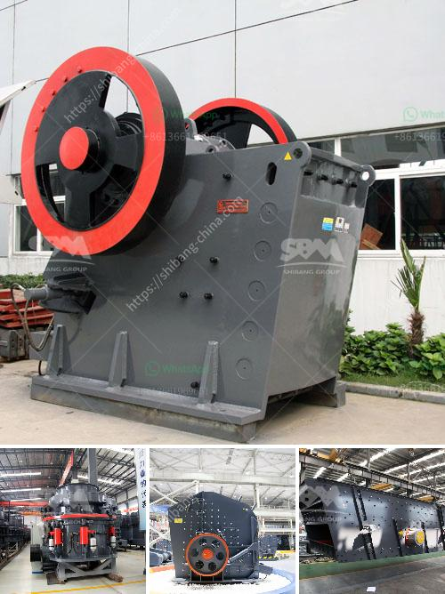

<h3>crusher hammer crusher price for stone</h3>
The hammer crusher, also named heavy hammer crusher, crushes by the collisions between high-speed hammer and materials. It has features of simple structure, high reduction ration, high efficiency, etc. As the main equipment in stone crusher plant, hammer crusher is ideally suitable for crushing all kinds of ores and any big-sized materials.

The price of the hammer crusher varies with models, manufacturing technology and spare parts. With 40 years of experience, FTM Machinery has been in line with market demands and improved product quality and technology for many times, thus, our hammer crusher has the advantages of low energy consumption and high automaticity.

With the development of infrastructure construction, the demand for sand (a kind of stone material) is increasing continuously, while natural sand is decreasing. By virtue of its own advantages, the crushed stone is gradually becoming one of the main resources for the construction of buildings, highways, railways, and other projects, attracting a broader market.

The hammer crusher, as an important crushing equipment in stone production line, widely used in construction, water conservancy, etc., attracts many users’ attention due to its unique advantages. As a professional manufacturer of mining machinery, FTM Machinery has made thorough analysis on the accessory price of the hammer crusher, and our experts will give you the most professional advice to help you compare the hammer crusher prices.

The production cost of the hammer crusher will vary according to the specific model, parameters, and configuration. Therefore, the price of the hammer crusher will vary widely.

There are many manufacturers of hammer crushers in the market today. However, not all manufacturers are reliable, some manufacturers have low production capacity and high power consumption, which may result in unstable product quality and ultimately increase production costs.

Direct-selling manufacturers will have a more competitive price compared to the middlemen manufacturers. This is because direct-selling manufacturers occupy a larger share in the market and have a stronger ability to control prices.

After-sales service is an essential factor for users to choose a hammer crusher manufacturer. A good after-sales service can effectively protect the user's rights and interests, reduce potential risks during the use of hammer crushers, and save time for customers to solve problems.

In conclusion, the price of the hammer crusher varies with the model, production capacity, and manufacturer. As a responsible enterprise, FTM Machinery will always provide reliable and reasonable hammer crusher prices to all valued customers, and we firmly believe that quality is the key to win the market. Let your money and production have a high added value with FTM Machinery!
<h3>Contact us</h3><ul><li><strong>Whatsapp:&nbsp;<a href="https://wa.me/8613661969651">+8613661969651</a></strong></li><li><a href="https://swt.shibang-china.com/?git&amp;zhl&amp;crusher hammer crusher price for stone"><strong>Online Service(chat now)</strong></a></li></ul><h3>Related</h3><ul><li><a href='how to crush granite to powder.md'>how to crush granite to powder</a></li><li><a href='how to make ball mill pdf.md'>how to make ball mill pdf</a></li><li><a href='zimbabwe clay brick making machine.md'>zimbabwe clay brick making machine</a></li><li><a href='crush molybdenum equipment.md'>crush molybdenum equipment</a></li><li><a href='mobile iron ore crusher.md'>mobile iron ore crusher</a></li></ul>