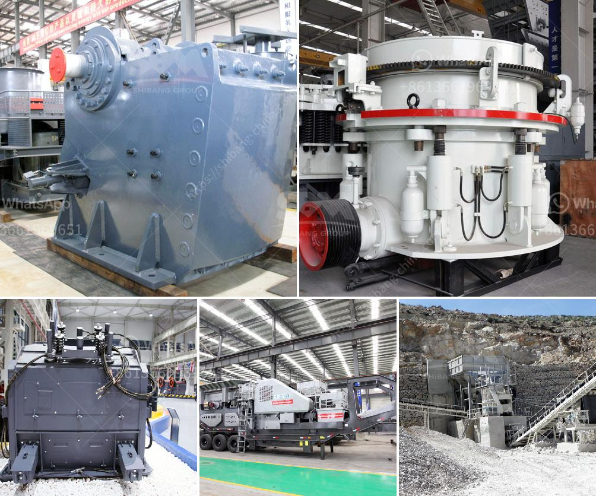

<h3>crusher hpt cone crusher price</h3>
The HPT cone crusher, also known as the multi-cylinder hydraulic cone crusher, is a high-performance crusher designed to meet and exceed the latest requirements for cone crushing technology. It combines mechanical, hydraulic, electrical, automation, intelligent control, and other technologies into one, making it the preferred choice for crushing operations in mining, construction, metallurgy, and other industries.

The HPT cone crusher has several advantages that set it apart from other cone crushers on the market. Firstly, it features a unique interparticle crushing action, which effectively improves the crushing ratio and throughput capacity. The crusher's eccentric bushing moves eccentrically during operation, allowing the mantle to move closer or away from the concave. This movement creates a compressive crushing action, reducing the size of the material and increasing its cubicity.

In addition to its superior crushing performance, the HPT cone crusher is also known for its high efficiency. The crusher is equipped with a hydraulic system that adjusts the discharge port size and cavity cleaning settings, ensuring the crusher operates at optimal levels. This system also protects the crusher from overloads and provides consistent product sizes.

Another notable feature of the HPT cone crusher is its intelligent control system. The crusher is equipped with sensors that monitor and adjust the crusher's settings in real-time, maximizing performance and minimizing downtime. The control system also allows remote monitoring and control, enabling operators to optimize crusher operation from a central control station.

When it comes to price, the HPT cone crusher offers excellent value for money. While its initial cost may be higher compared to other cone crushers, the HPT cone crusher's long-term operational and maintenance costs are significantly lower. Its robust construction and high-quality components ensure durability and reliability, reducing the need for frequent repairs and replacements. Furthermore, its efficient design and intelligent control system contribute to lower energy consumption, resulting in reduced operating costs.

The price of the HPT cone crusher varies depending on several factors, including the specific model, capacity, and optional features. However, as a rough estimate, the price of an HPT cone crusher typically ranges between $80,000 and $150,000 USD.

In conclusion, the HPT cone crusher is a powerful and efficient crushing solution that offers superior performance, high efficiency, and intelligent control. Its unique features, such as interparticle crushing, hydraulic system, and intelligent control, make it the preferred choice for demanding crushing applications. Despite its higher initial cost, the HPT cone crusher provides excellent value for money in the long run, as it offers reliable operation, low maintenance costs, and energy efficiency.
<h3>Contact us</h3><ul><li><strong>Whatsapp:&nbsp;<a href="https://wa.me/8613661969651">+8613661969651</a></strong></li><li><a href="https://swt.shibang-china.com/?git&amp;zhl&amp;crusher hpt cone crusher price"><strong>Online Service(chat now)</strong></a></li></ul><h3>Related</h3><ul><li><a href='cost of 200 tpd clinker grinding plant.md'>cost of 200 tpd clinker grinding plant</a></li><li><a href='copper gold crusher separator.md'>copper gold crusher separator</a></li><li><a href='feldspar powder morbi.md'>feldspar powder morbi</a></li><li><a href='crusher plant dolomite.md'>crusher plant dolomite</a></li><li><a href='basalt production machinery.md'>basalt production machinery</a></li></ul>