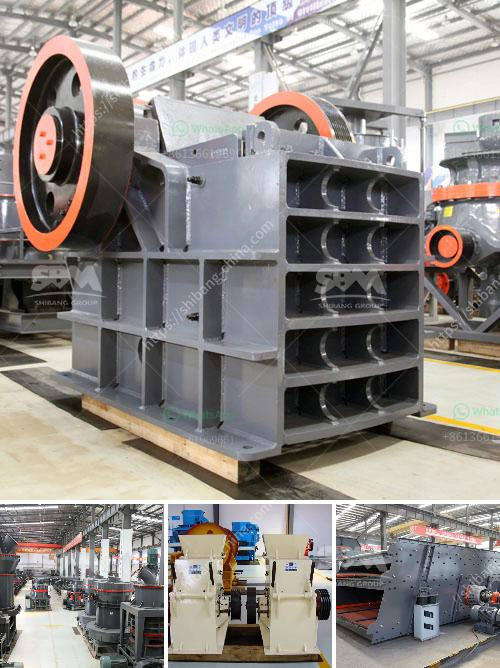

<h3>crusher in ethiopia</h3>
Ethiopia, being a major producer of agricultural products, is in dire need of enhancing its farming techniques. In recent years, the Ethiopian government has recognized the importance of agricultural development and has taken significant steps to improve the sector. One of the key components of this effort is the introduction of crushers in the farming industry.

A crusher is a machine designed to reduce large rocks into smaller rocks, gravel, or rock dust. Crushers can be used to reduce the size or change the form of waste materials, so they can be more easily disposed of or recycled. In Ethiopia, the use of crushers has been instrumental in improving agricultural productivity by enabling farmers to produce higher yields with less effort.

The introduction of crushers in Ethiopia has proven to be beneficial in numerous ways. Firstly, farmers can now process their crops and produce by-products such as flour, oil, or animal feed. This value addition allows them to fetch higher prices for their products, increasing their income and driving economic growth in the agriculture sector.

Secondly, the use of crushers reduces post-harvest losses significantly. In Ethiopia, post-harvest losses have always been a concern due to inadequate storage facilities and poor transportation infrastructure. With crushers, farmers can process their crops immediately after harvest, preventing wastage and ensuring better quality products.

Additionally, crushers have streamlined the farming process, reducing the labor and time required for tasks such as grinding grains or crushing oilseeds. This has enabled farmers to focus on other important activities, improving efficiency and productivity.

Moreover, the availability of crushers in rural areas has minimized the need for farmers to travel long distances to urban centers to process their crops. This not only saves time and money but also reduces the risks associated with transporting goods over long distances.

Overall, the introduction of crushers in Ethiopia has had a significant impact on the farming industry. It has allowed farmers to improve the quality of their products, reduce post-harvest losses, increase income, and enhance overall productivity. As the country continues to invest in agricultural development, the use of crushers is expected to play an even more crucial role in achieving sustainable growth in the sector.
<h3>Contact us</h3><ul><li><strong>Whatsapp:&nbsp;<a href="https://wa.me/8613661969651">+8613661969651</a></strong></li><li><a href="https://swt.shibang-china.com/?git&amp;zhl&amp;crusher in ethiopia"><strong>Online Service(chat now)</strong></a></li></ul><h3>Related</h3><ul><li><a href='lime stone crusher plant.md'>lime stone crusher plant</a></li><li><a href='coal washing plant for sale grinding mill china.md'>coal washing plant for sale grinding mill china</a></li><li><a href='barite grinding processing plant for sale.md'>barite grinding processing plant for sale</a></li><li><a href='quarry equipment manufacturer.md'>quarry equipment manufacturer</a></li><li><a href='typical 100tph jaw crusher feed size.md'>typical 100tph jaw crusher feed size</a></li></ul>