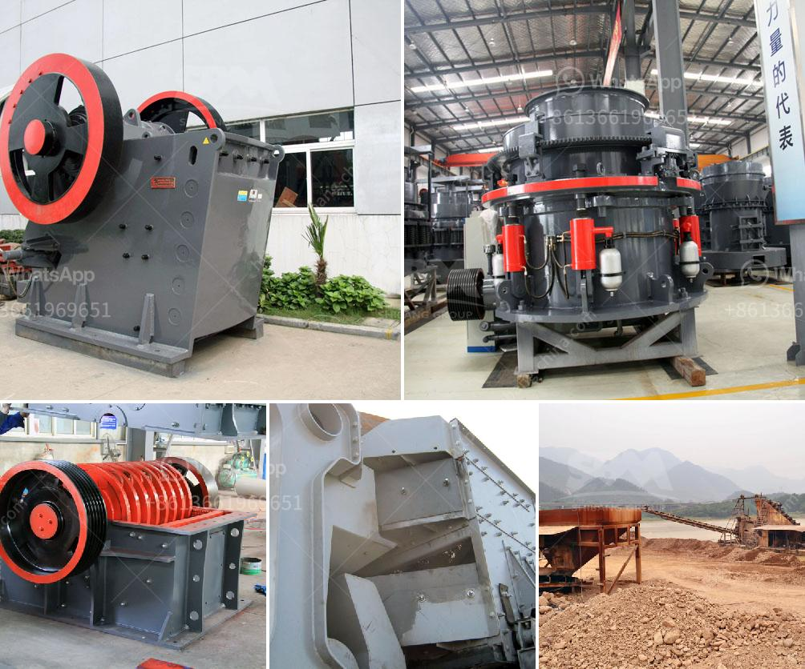

<h3>crusher information cone crusher mine</h3>
A cone crusher is used for crushing rock. The vast majority of these installations are found in mineral processing nations worldwide. In particular, those in the mining industry rely on cone crushers to process tonnes upon tonnes of ore material.

Crusher Information – Cone crushers are commonly used for secondary, tertiary, and quaternary crushing duties. Cone crusher consists of an inverted cone (the bowl or concave) that sits over a conical head (refer to figure). The feed inlet is at the apex of the crusher, and the material falls through the annular space between the mantle and the bowl. The crusher has a single cylinder that delivers materials to the crushing chamber. As the material enters the crushing chamber, the eccentrically rotating cone forces the material against the concave wall where it is comminuted. The crushed material then exits through the narrow space between the mantle and the bowl.

There are several types of cone crushers in the mining industry. Traditional cone crushers feature an outer concave, whereas modern cone crushers are typically comprised of an inner concave with a mantle attached to it. These crushers operate by compressing the material between the mantle and concave to achieve the desired size reduction.

Cone crushers are widely used in both the mining and aggregate industries for reducing the size of rocks and ores. Cone crushers are used in the aggregates and mining industries to crush rock material. The pressure on cone crusher liners is the key factor that influences the hydraulic pressure, power draw, and liner wear. In order to dynamically analyze and calculate cone crusher performance, the crushing force distribution analysis was conducted. The cone crusher is mainly used for secondary and tertiary crushing in mining and aggregates industries.

Several popular cone crusher models are currently in use for crushing purposes. However, each model is designed for specific practices and different applications. In mining, the most common cone crushers include spring cone crushers, hydraulic cone crushers, and high-efficiency cone crushers. Each crusher has its own unique features and advantages.

Spring cone crushers are used for crushing hard and medium-hard ores and rocks. They are widely used in metallurgy, construction, road building, chemical and silicate industries. Spring cone crushers are commonly used to crush various ores and rocks like iron ore, copper ore, limestone, quartz, granite, basalt, diabase, etc.

Hydraulic cone crushers are widely used in metallurgy, mining, cement, chemical and other industries. They have the advantages of high crushing ratio, high efficiency, low energy consumption, uniform product size, and suitable for various ores and rocks crushing.

Lastly, high-efficiency cone crushers are used for crushing ores and rocks. They have high crushing efficiency, speed, and overall performance, effectively reducing operating costs and improving profits.

In conclusion, cone crushers are a crucial part of the mining industry and play a crucial role in the material reduction process. Different types of cone crushers are available, each with its own unique features and advantages. Whether it is spring cone crushers, hydraulic cone crushers, or high-efficiency cone crushers, miners worldwide rely on these machines for efficient and effective rock crushing. As technology continues to advance, cone crushers will evolve and become even more efficient, allowing for increased productivity in the mining industry.
<h3>Contact us</h3><ul><li><strong>Whatsapp:&nbsp;<a href="https://wa.me/8613661969651">+8613661969651</a></strong></li><li><a href="https://swt.shibang-china.com/?git&amp;zhl&amp;crusher information cone crusher mine"><strong>Online Service(chat now)</strong></a></li></ul><h3>Related</h3><ul><li><a href='iron ore crusher plant.md'>iron ore crusher plant</a></li><li><a href='used jaw crusher for sale.md'>used jaw crusher for sale</a></li><li><a href='gravel crusher machine philippines.md'>gravel crusher machine philippines</a></li><li><a href='eagle 1400 crusher for sale.md'>eagle 1400 crusher for sale</a></li><li><a href='dolomite processing plant.md'>dolomite processing plant</a></li></ul>