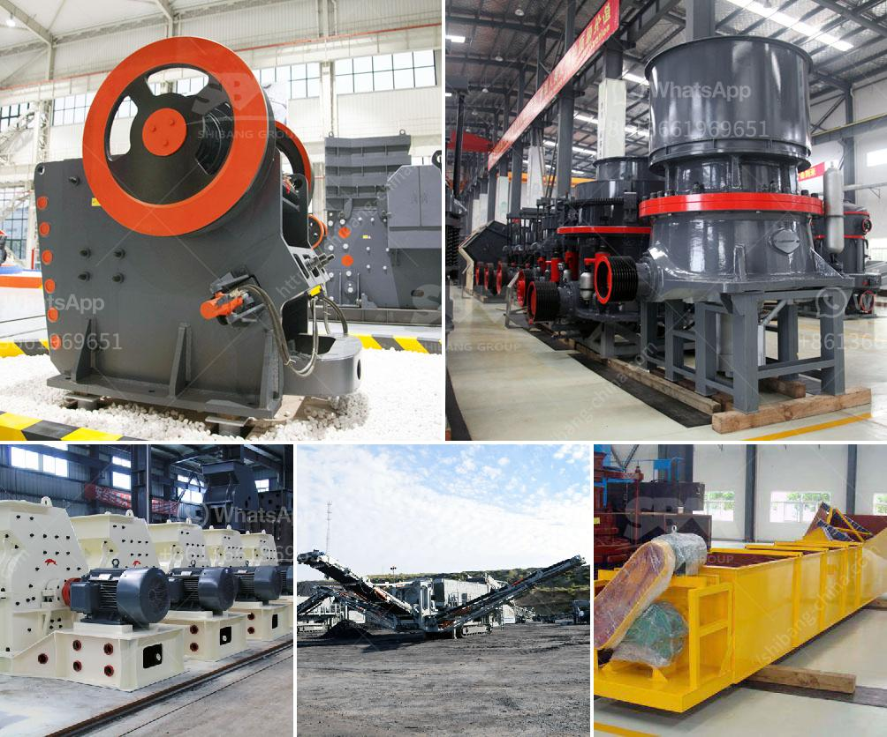

<h3>crusher machine factory in gujranwala pakistan</h3>
Gujranwala, a bustling industrial city in Pakistan's Punjab province, is renowned for its manufacturing and export of various products. Many industries, including textiles, ceramics, and sports goods, are flourishing in this region. One of the key industries that contribute significantly to Gujranwala's economy is the crusher machine factory.

The crusher machine factory in Gujranwala supplies high-quality machines to the construction and mining industries across Pakistan. These machines facilitate the construction and mining activities by reducing the size of large rocks and stones.

The crusher machines produced in Gujranwala are versatile and can be used for various purposes. They are designed to handle different types of materials, making them essential equipment in numerous industries. These machines can crush rocks, ores, minerals, stones, and other materials, transforming them into smaller, more manageable sizes.

The crusher machines manufactured in Gujranwala are known for their durability, efficiency, and reliability. They are made from high-quality materials, ensuring that they can withstand the rigors of heavy-duty operations. Additionally, these machines are equipped with advanced features and technologies, enhancing their performance and productivity.

The crusher machine factory in Gujranwala continually invests in research and development to improve and expand its product range. By incorporating the latest innovations and technologies, they strive to meet the evolving needs of their customers and stay ahead of the competition. This commitment to innovation has helped them become a leading supplier of crusher machines in Pakistan.

Moreover, the crusher machine factory in Gujranwala focuses on providing excellent customer service. They have a dedicated team of professionals who offer technical support and guidance to their clients. Whether it is installation, maintenance, or repairs, the factory ensures that their customers receive prompt assistance and solutions to their queries.

In addition to serving the domestic market, the crusher machine factory in Gujranwala also exports its products to international markets. They have successfully established a strong presence in neighboring countries, such as Afghanistan and Iran, as well as other countries in the Middle East. This international expansion has not only boosted the factory's revenue but also enhanced Pakistan's reputation as a reliable manufacturer of quality crusher machines.

Furthermore, the crusher machine factory in Gujranwala plays a vital role in the economic growth of the region. It provides employment opportunities to the local population, contributing to the reduction of unemployment and poverty. The factory also supports other industries indirectly by supplying them with the necessary machines for their operations.

In conclusion, the crusher machine factory in Gujranwala, Pakistan, is an essential player in the construction and mining industries. Its high-quality machines, commitment to innovation, and excellent customer service have positioned it as a reputable supplier, both domestically and internationally. With its contribution to the local economy and employment generation, the factory continues to play a significant role in Gujranwala's industrial development.
<h3>Contact us</h3><ul><li><strong>Whatsapp:&nbsp;<a href="https://wa.me/8613661969651">+8613661969651</a></strong></li><li><a href="https://swt.shibang-china.com/?git&amp;zhl&amp;crusher machine factory in gujranwala pakistan"><strong>Online Service(chat now)</strong></a></li></ul><h3>Related</h3><ul><li><a href='jaw crusher machine construction diagram.md'>jaw crusher machine construction diagram</a></li><li><a href='usinas de asfalto para venda em angola.md'>usinas de asfalto para venda em angola</a></li><li><a href='blake jaw crusher.md'>blake jaw crusher</a></li><li><a href='cone crusher middle east.md'>cone crusher middle east</a></li><li><a href='small stone crushing business in south africa.md'>small stone crushing business in south africa</a></li></ul>