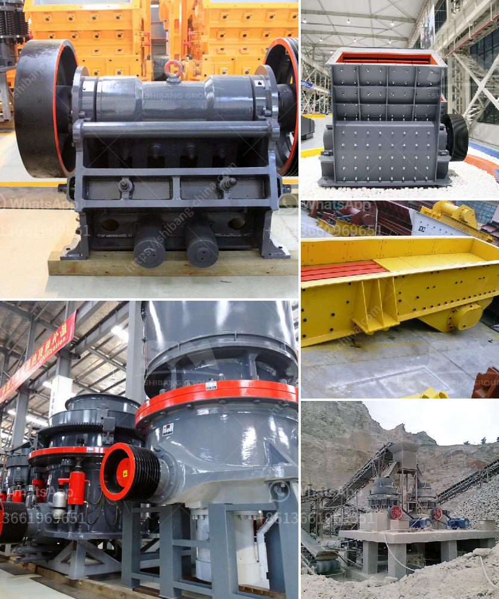

<h3>crusher machine for unit</h3>
Crusher machines are indispensable for processing various types of mineral ores and rocks in the mining industry. In a stone processing line, crusher machines are widely used. In order to break large stones into small pebbles, different types of crushing equipment are needed. In this regard, our aim is to provide an overview of the types of crushers commonly used in stone processing and their output sizes.

A crusher machine is a machine designed to reduce large rocks into smaller ones or gravel. In short, it can effectively reduce the size of the stones by manipulating the material force. With the advent of crusher machines, the dynamics of ore and rock crushing have been transformed by their effectiveness and efficiency.

One of the most commonly used crushing machines is the jaw crusher. It is a heavy-duty machine that is generally used for crushing different kinds of minerals and rocks that have a compressive strength under 320MPa. This jaw crusher is designed with the swing jaw fixed on the upper end and thus creating a variable feed area but a fixed discharge opening. As the material grains pass through the crusher, the size reduction is carried out by the compression of the feed material between two opposing jaws.

Another popular type of crusher machine is the impact crusher. These machines are used to crush rocks and other materials into smaller particles. They are commonly used for crushing medium-hard to hard rocks or ores in mining, metallurgy, building materials, cement, and chemical industries. The impact crusher is characterized by a large crushing ratio, high crushing efficiency, easy maintenance, low operation cost, and selective crushing ability.

In addition to jaw crushers and impact crushers, another commonly used crushing machine is the cone crusher. It is similar in operation to a gyratory crusher, with less steepness in the crushing chamber and more of a parallel zone between crushing zones. The cone crusher breaks rocks by squeezing the material between an eccentrically rotating spindle and a concave hopper.

Apart from these main crushers, in order to produce higher quality sand and gravel, aggregate, the tertiary crushing machines are usually hydraulic cone crushers or impact crushers. It is important to understand the properties of the aggregates and the type of material that needs to be crushed to ensure the optimal selection of crusher machines.

In conclusion, crusher machines are important equipment for processing various types of minerals and rocks in the mining industry. They have a wide range of applications in many fields, including construction, metallurgy, mining, and so on. Crushing machines are vital in achieving the desired particle size for various applications and to obtain the desired end product. With continuous technological advancements, crusher machines are becoming more efficient, reliable, and user-friendly. As a result, stone processing lines are increasingly relying on crusher machines to achieve efficient and precise crushing operations.
<h3>Contact us</h3><ul><li><strong>Whatsapp:&nbsp;<a href="https://wa.me/8613661969651">+8613661969651</a></strong></li><li><a href="https://swt.shibang-china.com/?git&amp;zhl&amp;crusher machine for unit"><strong>Online Service(chat now)</strong></a></li></ul><h3>Related</h3><ul><li><a href='sell crusher of jaw in peru.md'>sell crusher of jaw in peru</a></li><li><a href='best stone crushers india.md'>best stone crushers india</a></li><li><a href='gyratory crusher advantages and disadvantages.md'>gyratory crusher advantages and disadvantages</a></li><li><a href='china multifunction peeling and crushing.md'>china multifunction peeling and crushing</a></li><li><a href='continuous ball mill for sale in malaysia.md'>continuous ball mill for sale in malaysia</a></li></ul>