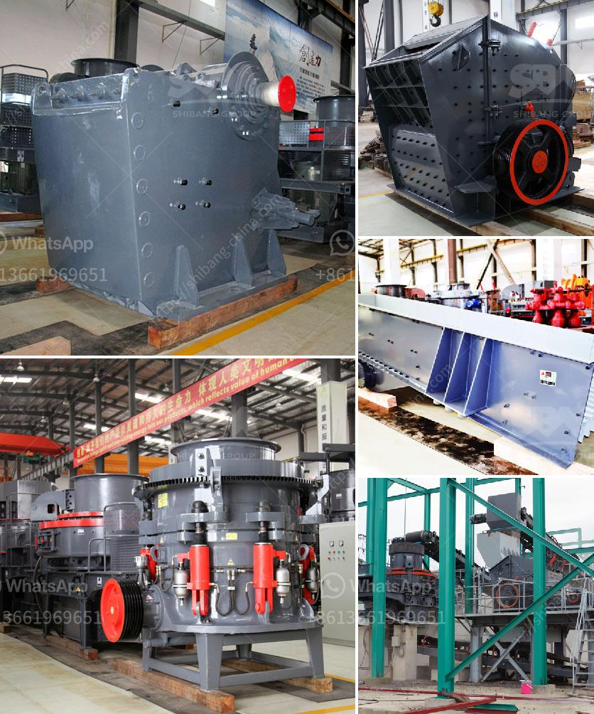

<h3>crusher machine in china</h3>
China has become one of the key markets for stone crushing equipment. The country is known to be one of the biggest construction sites in the world. Demand for crusher machines is witnessing steady growth with the expansion of major infrastructure projects and the construction industry. Backed by extensive experience in the field of construction machinery, SBM has been providing high-quality, reliable and efficient crusher machines for decades. The world's leading manufacturer of crushing equipment, SBM has been enhancing the production efficiency of its customers with its advanced technology and professional service.

Crusher machines play an essential role in the stone crushing process. They determine the final product quality and the productivity of the process. They also significantly influence the economic results of a stone quarry or mine site. The crusher machines produced by SBM are seen as advanced and reliable with exceptional technology and craftsmanship. High compression crushing is achieved through extrusion, grinding, shearing, and impact mechanisms. The commonly used crushers in China are jaw crushers, impact crushers, hammer crushers, compound crushers, roller crushers, etc.

Over the years, the demand for crusher machines has increased significantly due to the growth of China's construction industry. However, the excessive mining of natural resources and dumping of construction waste have led to environmental concerns. To address these issues, SBM has developed advanced technologies for eco-friendly crushing. These machines are equipped with dust prevention systems, water sprinklers, and foam dust suppression systems to reduce airborne particles and environmental pollution. They have been designed to optimize energy efficiency, leading to a reduction in energy consumption during the crushing process.

To meet the specific requirements of different construction projects, SBM offers customizable crusher machines. Clients can choose different crushing chambers, rotor speed, hammer count, and screen hole size, ensuring that the final product meets their desired specifications. Furthermore, SBM provides comprehensive after-sales service, including installation guidance, operation training, and maintenance support. This offers effective solutions to customers, ensuring the smooth operation of the equipment and maximizing their return on investment.

In recent years, China has been focusing on developing a sustainable and environmentally friendly economy. The government has implemented strict regulations to control the pollution caused by construction activities. SBM, as a responsible and socially conscious company, has been actively participating in sustainable development initiatives. The crusher machines produced by SBM comply with international environmental standards and are highly respected for their eco-friendly features.

Crusher machines in China are developed with a singular aim - to break down large rocks into smaller rocks, gravel, or rock dust. Crushing is essential for various construction activities, and it is considered to be one of the most economical and convenient methods observed around the globe. SBM has been a pioneer in crusher machine technology, delivering outstanding performance and value to customers. With the continuous development of infrastructure projects in China, the demand for crusher machines is set to grow further. SBM, as a leading manufacturer in the field, is committed to providing high-quality, reliable, and efficient crushing equipment to meet the evolving needs of the industry and contribute to the sustainable development of the country.
<h3>Contact us</h3><ul><li><strong>Whatsapp:&nbsp;<a href="https://wa.me/8613661969651">+8613661969651</a></strong></li><li><a href="https://swt.shibang-china.com/?git&amp;zhl&amp;crusher machine in china"><strong>Online Service(chat now)</strong></a></li></ul><h3>Related</h3><ul><li><a href='sale of crushers in malaysia.md'>sale of crushers in malaysia</a></li><li><a href='quartz crushing machine cost.md'>quartz crushing machine cost</a></li><li><a href='pe 500 750 jaw crusher price.md'>pe 500 750 jaw crusher price</a></li><li><a href='stone crusher plant hire gold in zimbabwe.md'>stone crusher plant hire gold in zimbabwe</a></li><li><a href='beneficiation plant for feldspar japan.md'>beneficiation plant for feldspar japan</a></li></ul>