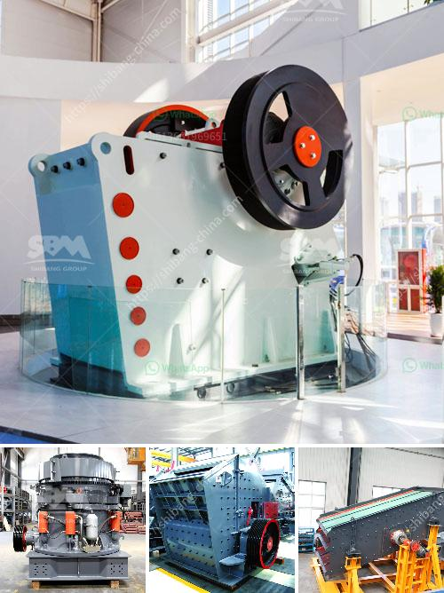

<h3>crusher machine manufacturers</h3>
Crusher machines are essential equipment in mining, construction, and several other industries where raw material is needed to be processed into smaller pieces. With the increasing demand for quality and efficient crushers, manufacturers are coming up with advanced machines to meet the requirements of their customers.

Crusher machine manufacturers have witnessed increased demand in recent years due to the rising need for finely crushed stones for construction purposes. The increasing popularity of stone products like aggregates for the construction industry coupled with a high demand for road construction materials has led to the growth of the crusher machine manufacturing industry.

These manufacturers are constantly innovating and upgrading their machines to provide the latest technology and optimal efficiency. They focus on producing machines that can handle a wide range of materials, from soft and brittle to hard and abrasive. Their crushers are designed to deliver consistent product size, maximum throughput, and low operational costs.

Additionally, crusher machine manufacturers offer a wide range of machines to cater to different customer needs. There are primary crushers, secondary crushers, tertiary crushers, and even quaternary crushers available in the market. Each type of crusher serves a specific purpose, ensuring smooth operations and reducing downtime.

To provide durable and reliable machines, manufacturers use high-quality materials and components during the manufacturing process. They also employ strict quality control measures to ensure that their products meet industry standards and customer expectations.

Moreover, crusher machine manufacturers also offer a comprehensive after-sales support system to address any queries or issues that customers may face. This includes prompt servicing, spare part availability, and technical assistance, thus ensuring maximum uptime for their machines.

In conclusion, crusher machine manufacturers play a crucial role in meeting the growing demand for crushed stones and construction materials. With their constant innovation, advanced technology, and commitment to quality, they are providing efficient machines that enhance productivity and profitability in various industries. By investing in high-quality crushers from reputable manufacturers, businesses can benefit from improved efficiency and cost-effectiveness, ultimately contributing to their success.
<h3>Contact us</h3><ul><li><strong>Whatsapp:&nbsp;<a href="https://wa.me/8613661969651">+8613661969651</a></strong></li><li><a href="https://swt.shibang-china.com/?git&amp;zhl&amp;crusher machine manufacturers"><strong>Online Service(chat now)</strong></a></li></ul><h3>Related</h3><ul><li><a href='alluvial gold processing plant for small scale.md'>alluvial gold processing plant for small scale</a></li><li><a href='stone crusher manufactured in new zealand.md'>stone crusher manufactured in new zealand</a></li><li><a href='used sand washing machine for sale.md'>used sand washing machine for sale</a></li><li><a href='concrete crusher in kenya.md'>concrete crusher in kenya</a></li><li><a href='jaw crusher prices.md'>jaw crusher prices</a></li></ul>