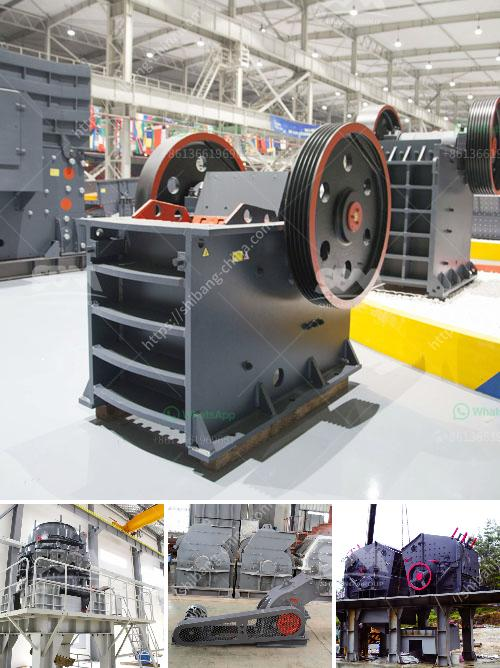

<h3>crusher machine on lease in hyderabad</h3>
Increasing construction activities across the globe is spurring the demand for raw materials and building materials. With this, the demand for crusher machines is also increasing. Nowadays, crusher machines are used for crushing stones, rocks, and other hard materials. The leased crusher machines are specifically designed for handling complex tasks efficiently. As a result, building material suppliers and construction companies are opting for crusher machines on lease in Hyderabad.

Leasing crusher machines from a reliable supplier can be a game-changer for construction companies in Hyderabad. The crusher machine on lease in Hyderabad is a good investment for construction companies who are looking to improve their business profitability. With low investment, costs involved, there are no major restrictions in terms of operating the crusher plants on a lease basis.

Moreover, the crusher plants on a turnkey basis have great advantages for the construction and quarry operators. It minimizes the downtime and reduces the cost of maintenance. Being a prominent crusher machine manufacturer and supplier in Hyderabad, our company has invested heavily in the infrastructure and established a state-of-the-art manufacturing unit integrated with modern technology.

Our clients can avail the crusher machines in diverse specifications and capacities as per their requirements. The crushers on lease basis have a provision for both fixed and mobile crushing operations. They are easily replaceable and can be expanded or altered as per the clients' specific needs. These crushers are versatile, easily transportable, and easily adjustable to the crushing process.

The lease agreements can be concluded with various types of entities, such as individuals, corporations, and government bodies. The lease agreement document provides specific terms and conditions under which the crusher machines can be utilized, and among them, few usually include the time period of the lease, the payment amount, and the mode of payment.

Leasing is versatile in nature and constitutes an attractive alternative to owning. It avoids the initial cost involved in the purchase of machinery, maintenance, and operational costs. In addition, it allows businesses to focus on their core competencies rather than getting entangled in the process of buying and maintaining machinery.

Leasing crusher machines provides numerous benefits such as minimizing the cost of transportation, operation, and maintenance, thus ensuring high returns on investment. Additionally, it helps construction companies and building material suppliers to reduce downtime and eliminate the chances of equipment failure, ultimately boosting productivity.

Another notable advantage of leasing crusher machines is the tax benefits it provides. As a leased asset, companies can claim tax benefits for the lease rentals paid, reducing their overall tax liability. This further enhances the profitability of the business.

In conclusion, opting for crusher machines on lease in Hyderabad can be the perfect solution for construction companies and building material suppliers. With flexible terms and conditions, low initial investment, and high returns on investment, leasing crusher machines are ideal for businesses focused on profitability and growth. So, if you are planning to set up a crusher machine on lease in Hyderabad, contact us today and we will guide you through the entire process.
<h3>Contact us</h3><ul><li><strong>Whatsapp:&nbsp;<a href="https://wa.me/8613661969651">+8613661969651</a></strong></li><li><a href="https://swt.shibang-china.com/?git&amp;zhl&amp;crusher machine on lease in hyderabad"><strong>Online Service(chat now)</strong></a></li></ul><h3>Related</h3><ul><li><a href='suppliers of chrome ore beneficiation plant.md'>suppliers of chrome ore beneficiation plant</a></li><li><a href='mobile crusher di malaysia.md'>mobile crusher di malaysia</a></li><li><a href='samp hammer mill china.md'>samp hammer mill china</a></li><li><a href='marble production line germany.md'>marble production line germany</a></li><li><a href='sayaji crusher pdf.md'>sayaji crusher pdf</a></li></ul>