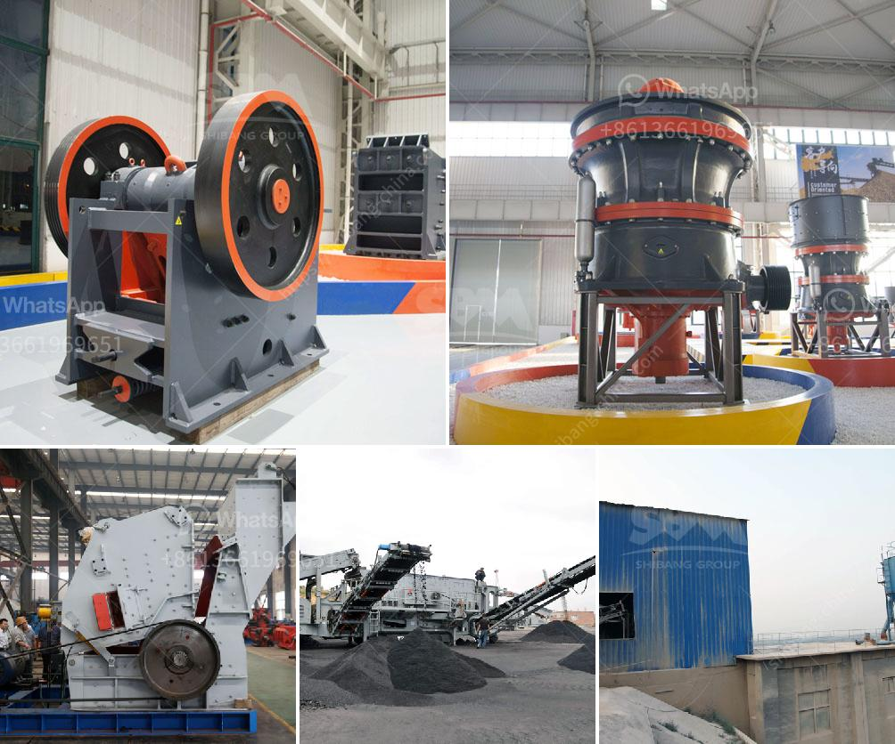

<h3>crusher machine philippine distributor and price</h3>
Crusher machines play an essential role in the mining industry, where they are used to break down larger rocks into smaller pieces for further processing. In the Philippines, several companies distribute crusher machines to various mining sites. These distributors help ensure that mining operations have access to the necessary equipment to efficiently extract and process minerals.

One of the reputable crusher machine distributors in the Philippines is ABC Machinery. With years of experience in the industry, ABC Machinery has gained a strong reputation for providing reliable and high-quality machines to mining companies. Their machines are known for their durability and efficiency, making them ideal for the demanding conditions of mining operations.

When it comes to pricing, crusher machines in the Philippines vary depending on several factors. The size and capacity of the machine, as well as the brand and features, all affect the price range. Generally, crusher machines can cost anywhere from a few hundred thousand pesos to several million pesos.

It is important for mining companies to carefully consider their specific needs and budget before purchasing a crusher machine. Additionally, it is advisable to reach out to reputable distributors like ABC Machinery to get accurate and up-to-date pricing information.

Moreover, apart from the initial purchase cost, mining companies should also consider the maintenance and operational costs associated with crusher machines. Regular maintenance and occasional repairs are necessary to keep the machines in optimal condition, ensuring their longevity and productivity.

In conclusion, crusher machines are essential equipment in the mining industry. Distributors in the Philippines, such as ABC Machinery, provide a wide range of options to mining companies. Prices can vary depending on several factors, so it is crucial for companies to thoroughly assess their needs and budget before making a purchase. Working with reputable distributors ensures access to high-quality machines that deliver efficient and reliable performance, helping mining companies maximize their productivity and profitability.
<h3>Contact us</h3><ul><li><strong>Whatsapp:&nbsp;<a href="https://wa.me/8613661969651">+8613661969651</a></strong></li><li><a href="https://swt.shibang-china.com/?git&amp;zhl&amp;crusher machine philippine distributor and price"><strong>Online Service(chat now)</strong></a></li></ul><h3>Related</h3><ul><li><a href='aggregate crusher for sale in philippines.md'>aggregate crusher for sale in philippines</a></li><li><a href='crusher stone crusher 10x 21 america.md'>crusher stone crusher 10x 21 america</a></li><li><a href='project report clay brick manufacturing.md'>project report clay brick manufacturing</a></li><li><a href='ballast crushing machine small.md'>ballast crushing machine small</a></li><li><a href='rock grinding equipment for sale in texas.md'>rock grinding equipment for sale in texas</a></li></ul>