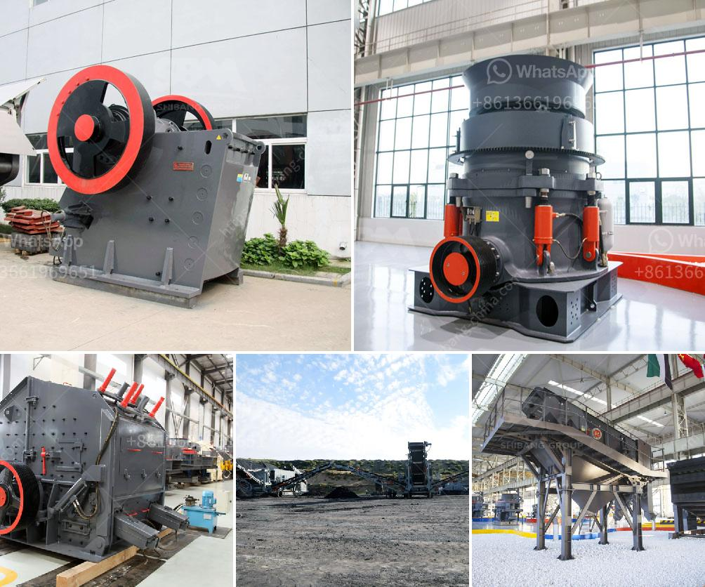

<h3>crusher machine price in nigeria</h3>
Nigeria is a vast country with considerable wealth in natural resources and understanding Nigeria’s geology is critical for efficient exploration and exploitation of these resources. Stone crushing is an important part in mining industry and require high quality stone crushing machines in Nigeria.

The extracted raw stone materials will be transported from the blast site to the primary crusher. Depending on the design of the crusher machine, a feeder may or may not be required before the primary crusher. The haul trucks load the shot rock into the primary jaw crusher, which feeds the rocks to a primary vibrating screen, which separates the rocks into different sizes. Depending on the size of the rocks and desired product size, secondary crushers may be used, such as cone crushers or impact crushers. 

Lagos is a well-known city in Nigeria and serves as the capital of Lagos State. Lagos, which is sometimes referred to as Lagos Island, is responsible for generating the highest GDP across all states in Nigeria. Over the past few decades, the city has developed amazing infrastructures and increased its investment in various industries. One of these industries is the mining and quarry industry.

Crushers are machines used to crush various materials, including stones, rocks, ore, and minerals. They are widely used in the mining and construction industry due to great efficiency in every crushing task. They allow operators to crush the materials to a specific size by adjusting the plates at the bottom and capable of moving around for processing materials on-site.

When it comes to the price of machines of this nature in Nigeria, it is essential to consider a few factors. These factors include:

1. Brand Awareness: Different brands vary in price. Some popular and reliable brands might come with a higher price tag, while lesser-known brands might have more affordable options.

2. Production Capacity: Crushers come in different sizes. The bigger the machine's capacity, the higher the price, as these machines are designed to handle larger quantities of materials.

3. Quality and Durability: Crushers made with high-quality materials and built to withstand heavy use will generally have a higher price but offer better long-term value.

4. After-Sales Service: The availability of after-sales service and support is also an important factor in the overall price. It is recommended to choose a machine that comes with good after-sales service to address any issues that may arise in the future.

5. Market Demand: Supply and demand play a significant role in influencing prices. If there is a high demand for crushers in Nigeria, prices may increase.

In conclusion, the crusher machine price in Nigeria with 300-500 word is a topic worthy of being discussed, especially from the perspective of developing countries. The scarcity of resources and technological investment constraints faced by Nigerian industries highlight the importance of a reliable crusher machine as a tool for their continued growth. With the right machine at the right price, businesses in Nigeria can achieve efficiency, productivity, and profitability in their operations.
<h3>Contact us</h3><ul><li><strong>Whatsapp:&nbsp;<a href="https://wa.me/8613661969651">+8613661969651</a></strong></li><li><a href="https://swt.shibang-china.com/?git&amp;zhl&amp;crusher machine price in nigeria"><strong>Online Service(chat now)</strong></a></li></ul><h3>Related</h3><ul><li><a href='impact crusher sale.md'>impact crusher sale</a></li><li><a href='basalt crushing machine.md'>basalt crushing machine</a></li><li><a href='crusher machine in china.md'>crusher machine in china</a></li><li><a href='screen and crusher hire.md'>screen and crusher hire</a></li><li><a href='grinding mill machine.md'>grinding mill machine</a></li></ul>