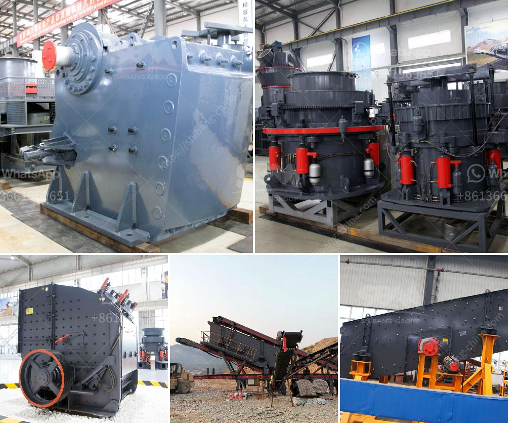

<h3>crusher machine to make crushed sand from mm</h3>
Crusher machines are widely used in the mining and construction industry for reducing the size of rocks and stones. However, these machines also have a unique ability to turn hard and abrasive rocks into crushed sand. This process is an excellent solution for producing high-quality sand for various applications. In this article, we will discuss crusher machines that can efficiently make crushed sand from 0-5mm.

Crushed sand is a byproduct generated during the crushing process of rocks. It is extensively used in the construction industry, specifically for concrete production. Unlike natural sand, crushed sand possesses angular particles that offer better stability and strength to concrete structures. Therefore, the demand for crushed sand has been steadily rising.

To meet this growing demand, crusher machines have been designed and developed specifically for producing crushed sand. These machines are equipped with advanced technology and powerful components to ensure maximum efficiency and superior-quality output. They can crush various types of rocks, such as granite, limestone, basalt, and more, into fine particles.

One of the notable crusher machines used for producing crushed sand is the Sandvik CV-series vertical shaft impactor (VSI). This machine combines a rotor with an impact chamber for improved performance. The material is fed through a tube onto the rotor, where it is accelerated to high speeds before being thrown against an anvil wall. The impact of the rock-on-rock collision breaks the larger rocks into smaller pieces, creating crushed sand particles.

The Sandvik CV-series VSI machines boast high productivity rates, low operating costs, and minimal maintenance requirements. They are also equipped with a special air filtration system to suppress dust emissions, ensuring a safe and environmentally-friendly working environment. Additionally, these machines have adjustable settings that allow the production of different sand gradations, with an emphasis on the 0-5mm range.

Another crusher machine that excels at producing crushed sand is the Nordberg GP cone crusher. This robust machine utilizes a high-power motor and a sturdy construction to effectively crush rocks into fine particles. The Nordberg GP cone crusher offers a versatile crushing process, allowing the production of various sand gradations, including the 0-5mm range.

Furthermore, the Nordberg GP cone crusher is equipped with advanced automation features, such as remote control capabilities and real-time monitoring of the crusher's performance. This enables operators to optimize the production process and ensure consistent quality of the crushed sand.

In conclusion, crusher machines play a crucial role in the production of crushed sand. They are designed to efficiently break down hard and abrasive rocks into fine particles. The Sandvik CV-series VSI and Nordberg GP cone crusher are two examples of crusher machines that excel at producing crushed sand in the 0-5mm range. These machines offer high productivity, cost-effectiveness, and excellent quality output, making them vital equipment for the sand production industry.
<h3>Contact us</h3><ul><li><strong>Whatsapp:&nbsp;<a href="https://wa.me/8613661969651">+8613661969651</a></strong></li><li><a href="https://swt.shibang-china.com/?git&amp;zhl&amp;crusher machine to make crushed sand from mm"><strong>Online Service(chat now)</strong></a></li></ul><h3>Related</h3><ul><li><a href='multi hammer crusher.md'>multi hammer crusher</a></li><li><a href='crusher prices in kenya.md'>crusher prices in kenya</a></li><li><a href='howhow to set up a stone crushing business.md'>howhow to set up a stone crushing business</a></li><li><a href='sand and gravel separation machine.md'>sand and gravel separation machine</a></li><li><a href='deed of stone mining business.md'>deed of stone mining business</a></li></ul>