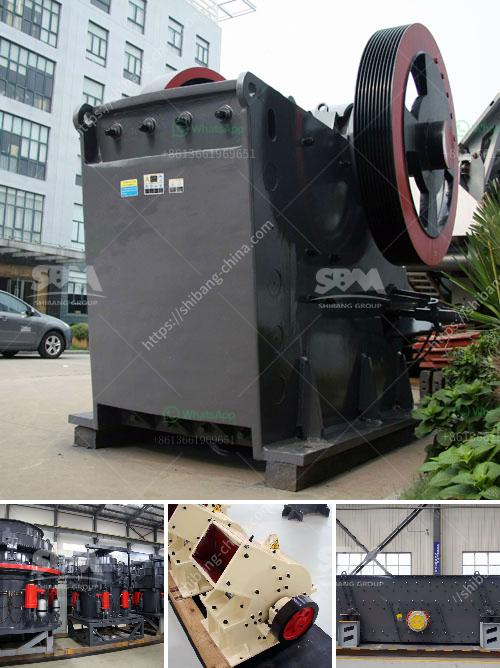

<h3>crusher mill for china price</h3>
Crusher mills play a vital role in many industries such as mineral processing, construction, cement production, and power generation. These machines are designed to reduce large rocks into smaller, more manageable sizes, making them suitable for various applications. In China, crusher mills are highly sought after, and their prices vary depending on different factors including the production capacity and features of the machine.

One of the primary factors influencing the price of crusher mills in China is the production capacity. Generally, crusher mills with higher production capacities tend to be more expensive. This is because machines with larger capacities require more robust materials and components to withstand the high workload. Moreover, they often come equipped with advanced technology and automation systems to maximize efficiency and productivity. Therefore, it's not surprising to find that crusher mills with a higher production capacity, such as 200-300 tons per hour or even more, typically have higher prices.

Another crucial factor affecting the price of crusher mills in China is the features of the machine. Some crusher mills are designed for specific applications, such as crushing hard and abrasive materials, while others are more versatile and can handle a wide range of materials. Machines with specialized features, such as adjustable closed-side settings, hydraulic control, or protective coatings, generally command a higher price due to their enhanced functionality and durability. Customers often prioritize these added features to ensure the longevity and efficiency of their crusher mills.

Moreover, the brand and reputation of the manufacturer also impact the pricing of crusher mills. China has a vast number of crusher mill manufacturers, ranging from large, well-established companies to smaller, emerging ones. Well-known and reputable manufacturers often have higher price tags due to their consistent quality and customer satisfaction record. These manufacturers invest significantly in research and development to produce innovative designs and reliable machines, which translates into slightly higher prices. On the other hand, smaller manufacturers who are looking to penetrate the market often offer their products at competitive prices to attract customers and gain market share.

Additionally, the raw material and labor costs in China also influence the pricing of crusher mills. The cost of materials such as steel and alloys, which are used in the construction of crusher mills, can fluctuate based on market conditions. Similarly, labor costs vary depending on the region and the skill level of the workforce. These factors are considered by manufacturers when determining the price of their crusher mills.

In conclusion, crusher mills are essential machines in various industries, and their prices in China vary depending on factors such as production capacity, features, manufacturer reputation, and raw material/labor costs. Customers and industry professionals should carefully consider these factors to choose the most suitable and cost-effective crusher mill for their specific requirements. It's always advisable to conduct thorough research, compare different options, and consider long-term benefits and performance when making a purchasing decision.
<h3>Contact us</h3><ul><li><strong>Whatsapp:&nbsp;<a href="https://wa.me/8613661969651">+8613661969651</a></strong></li><li><a href="https://swt.shibang-china.com/?git&amp;zhl&amp;crusher mill for china price"><strong>Online Service(chat now)</strong></a></li></ul><h3>Related</h3><ul><li><a href='how to start stone crushing business in kenya.md'>how to start stone crushing business in kenya</a></li><li><a href='price stone crusher.md'>price stone crusher</a></li><li><a href='cost of stone crushing plant.md'>cost of stone crushing plant</a></li><li><a href='micro powder grinding mill scm series.md'>micro powder grinding mill scm series</a></li><li><a href='portable rock crusher machine for sale kenya.md'>portable rock crusher machine for sale kenya</a></li></ul>