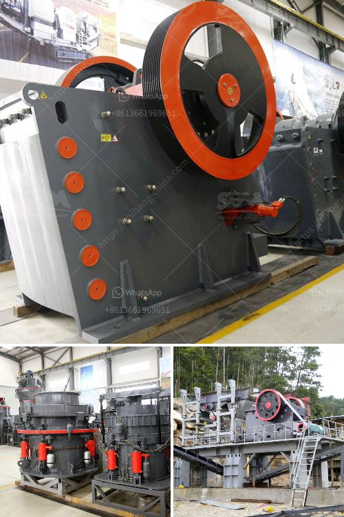

<h3>crusher plant dolomite</h3>
Dolomite is a natural mineral that is commonly used for the production of building materials such as bricks, tiles and concrete. This mineral is also used in the construction industry for the production of aggregates, which are used in the manufacturing of concrete. Dolomite is commonly extracted from a quarry and processed into different forms for various applications.

One of the most common uses of dolomite is in the construction industry. Dolomite is often crushed and used as a substitute for limestone in road construction projects. It is also used as an aggregate in concrete and asphalt mixes. Dolomite is an important filler material used in the production of building materials such as bricks, tiles, and concrete. It improves the drying and hardening properties of the materials, making them more durable and resistant to water and weathering.

To process dolomite, firstly dolomite is sent to jaw crusher for primary crushing, which reduces the size of the material and prepares it for further processing. Then, the material is sent to the impact crusher or cone crusher for secondary crushing. After crushing, the materials are sieved by a vibrating screen, and then transported by a belt conveyor to a cone crusher for fine crushing. Dolomite particles that meet the desired size requirements are transported to the finished product pile by the belt conveyor. Oversized dolomite is returned to the cone crusher for re-crushing.

Crusher plants are set up at various locations to process dolomite. Depending on the application, different types of crushers are used. Dolomite processing can be divided into three stages: primary crushing, secondary crushing, and tertiary crushing. Crushing should reduce the dolomite mineral to grains of less than a few millimeters across. The goal is to make a coarse-grade dolomite that can be used as the basic material for building materials such as concrete and asphalt. Dolomite that meets the requirements is transported to the stockpile for storage.

In addition to the construction industry, dolomite is also used in the agriculture industry. It is commonly used as a soil amendment to raise the pH of acidic soils and provide essential nutrients to plants. Dolomite contains calcium and magnesium, which are important for plant growth. It is often used as a supplement in fertilizers to improve the fertility and productivity of the soil.

In conclusion, crusher plants play a crucial role in the production of dolomite for various applications. Dolomite is widely used in the construction and agriculture industries due to its properties that enhance the durability and fertility of materials and soils. With the right equipment and processes, crusher plants efficiently extract and process dolomite to meet the needs of different industries. The utilization of dolomite in construction and agriculture contributes to the development of infrastructure and the growth of agricultural productivity.
<h3>Contact us</h3><ul><li><strong>Whatsapp:&nbsp;<a href="https://wa.me/8613661969651">+8613661969651</a></strong></li><li><a href="https://swt.shibang-china.com/?git&amp;zhl&amp;crusher plant dolomite"><strong>Online Service(chat now)</strong></a></li></ul><h3>Related</h3><ul><li><a href='dolomite crushing plant price in india.md'>dolomite crushing plant price in india</a></li><li><a href='crusher stone crusher 10x 21 america.md'>crusher stone crusher 10x 21 america</a></li><li><a href='rock crusher in antioquia rock.md'>rock crusher in antioquia rock</a></li><li><a href='coal pulverisers machines.md'>coal pulverisers machines</a></li><li><a href='used vertical grinding machine.md'>used vertical grinding machine</a></li></ul>