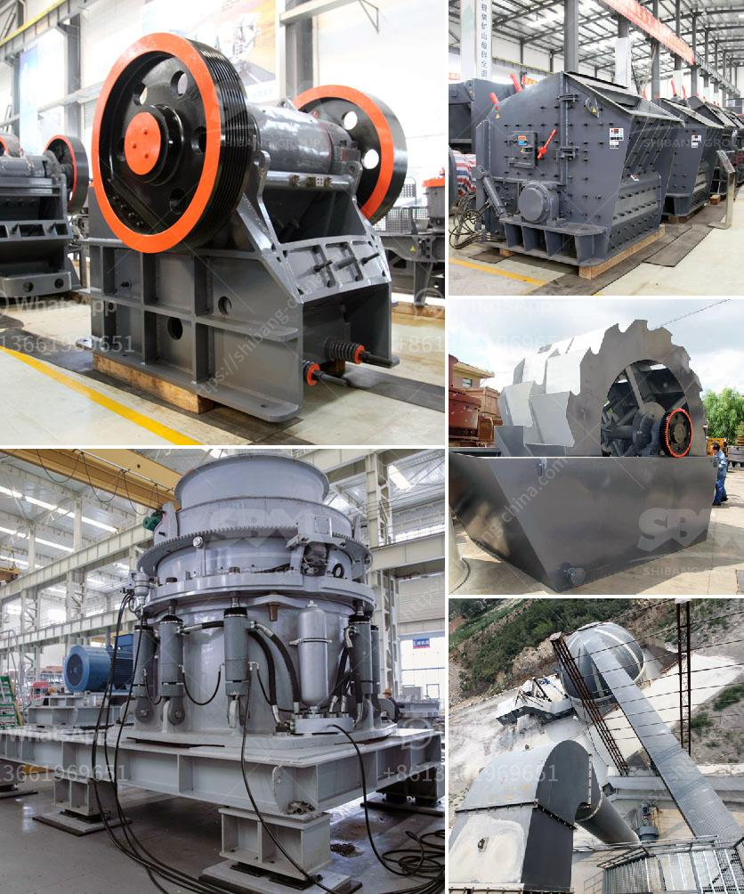

<h3>crusher plant in nigeria pakistan</h3>
Crusher plant in Nigeria Pakistan is widely used in the cement industry, mining industry, building material, highway, railway, water conservancy, chemical materials and many other departments. The crusher plant in Pakistan is mainly composed of a jaw crusher, impact crusher, cone crusher, vibrating feeder, vibrating screen, belt conveyor and centralized electric control system.

The capacity of the crusher plant is related to the maximum feed size that is to be crushed. In the case of Nigeria Pakistan, the maximum feed size is determined by the size of the inlet opening, which is wider and allows large-sized materials to be easily crushed. This characteristic makes the crusher plant ideal for handling large-sized materials, especially in the mining industry where rocks and ores need to be crushed into smaller sizes for further processing.

The crusher plant in Nigeria Pakistan is equipped with advanced electronic control operating system, which ensures smooth discharging, reliable performance, high efficiency and energy conservation. The crusher plant is also equipped with a hydraulic system that adjusts the size of the crusher discharge port, which is convenient for operators to control the product particle size. In addition, the intelligent control system can achieve the functions of remote monitoring, operation and maintenance.

The crusher plant in Nigeria Pakistan is continuously updated and improved on the basis of more than 20 years of experience in the mining machinery industry. The crusher plant in Nigeria Pakistan has the advantages of large crushing ratio, uniform product size, simple structure, reliable operation, simple maintenance and low operating cost. It is the preferred equipment for crushing various hard and medium hard rocks and ores such as limestone, granite, basalt, quartz, iron ore, diabase, gold ore and copper ore.

Overall, crusher plant in Nigeria Pakistan provides high efficiency and low cost for customers. It is praised by many mining operators worldwide. If you have any specific requirements about this crusher plant, please contact us and our professional engineers will customize the most suitable solution for you.
<h3>Contact us</h3><ul><li><strong>Whatsapp:&nbsp;<a href="https://wa.me/8613661969651">+8613661969651</a></strong></li><li><a href="https://swt.shibang-china.com/?git&amp;zhl&amp;crusher plant in nigeria pakistan"><strong>Online Service(chat now)</strong></a></li></ul><h3>Related</h3><ul><li><a href='stoner cusher price in kenya.md'>stoner cusher price in kenya</a></li><li><a href='dry processing machine supplier.md'>dry processing machine supplier</a></li><li><a href='multi hammer crusher.md'>multi hammer crusher</a></li><li><a href='crushing plant tenova.md'>crushing plant tenova</a></li><li><a href='ball mill grinding and particle.md'>ball mill grinding and particle</a></li></ul>