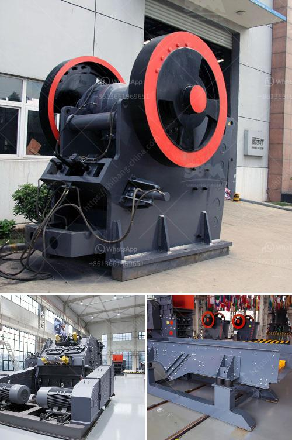

<h3>crusher plant quarry philippines</h3>
The Philippines is known for its rich mineral resources. Every year, the government invests billions of pesos in the extraction and development of these minerals, including quarrying. Quarrying involves removing minerals or stones from the earth's surface. One of the most popular quarrying activities these days is the operation of crusher plants.

Crusher plants are built to rock the mountainside and turn raw rocks into coveted aggregates. For construction purposes, this process delivers the desired size and quality of stones, which are then used for various construction projects, such as roads, buildings, bridges, and railways.

One of the premier crusher plants in the Philippines is found in the province of Batangas. It is located in the municipality of Rosario, within Barangay San Rafael. The facility was established in 2006 and has been recognized as one of the leading crusher plants in the country for its exceptional performance and constant innovation in technology.

This crusher plant in Rosario has a capacity of producing 300 to 500 tons of crushed aggregates per hour. It crushes and processes various types of stones, such as limestone, granite, basalt, and river stones. The plant is equipped with state-of-the-art machines, such as primary jaw crushers, secondary cone crushers, and tertiary impact crushers, along with vibrating screens.

The entire crusher plant operates under strict environmental guidelines to minimize its impact on the surrounding areas. The company responsible for the operation constantly monitors the air quality and water discharge to ensure compliance with regulatory standards. Noise pollution is also kept to a minimum by implementing noise suppression equipment.

Furthermore, the crusher plant provides employment opportunities for the local community. It requires skilled workers for various positions, such as operators, mechanics, engineers, and administrative staff. This helps boost the local economy by providing stable and decent jobs for residents. In addition, the company supports the community through various corporate social responsibility initiatives, including educational sponsorships and infrastructure projects.

The products of this crusher plant are highly sought after by construction companies throughout the Philippines. Its consistent production of high-quality aggregates guarantees the durability and strength of structures. Moreover, the crusher plant offers a wide range of sizes to cater to the needs of different construction projects.

In conclusion, the crusher plant quarry in the Philippines plays a significant role in the construction industry. Its efficient operation and compliance with environmental standards provide the country with reliable and sustainable sources of building materials. Not only does it contribute to the development of infrastructure, but it also creates job opportunities and supports the growth of the local economy. As the demand for aggregates continues to rise in the Philippines, crusher plants like this will continue to play a crucial role in meeting the country's construction needs.
<h3>Contact us</h3><ul><li><strong>Whatsapp:&nbsp;<a href="https://wa.me/8613661969651">+8613661969651</a></strong></li><li><a href="https://swt.shibang-china.com/?git&amp;zhl&amp;crusher plant quarry philippines"><strong>Online Service(chat now)</strong></a></li></ul><h3>Related</h3><ul><li><a href='big crushing machine.md'>big crushing machine</a></li><li><a href='sand washing system.md'>sand washing system</a></li><li><a href='gypsum crusher supplier in uae.md'>gypsum crusher supplier in uae</a></li><li><a href='stoner cusher price in kenya.md'>stoner cusher price in kenya</a></li><li><a href='small scale gold mining equipment for sale auction.md'>small scale gold mining equipment for sale auction</a></li></ul>