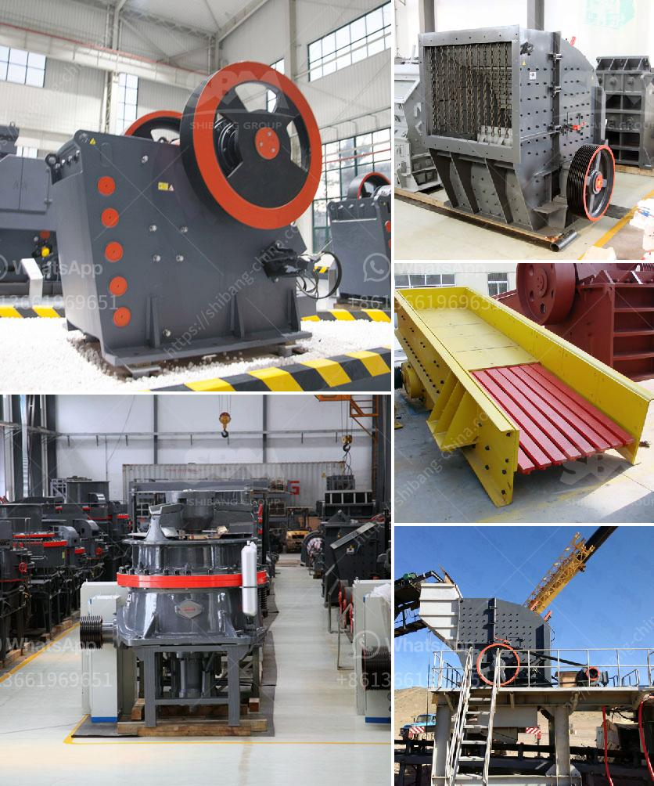

<h3>crusher plants in kuwait</h3>
Crusher plants are vital machines in many industries such as mining, construction, and metallurgy. These plants are used in various stages of the production process when processing rocks and ores. The purpose of crusher plants is to reduce the size of rocks so that they can be further processed for various purposes. According to the needs of industries, various types of crusher plants are available in Kuwait.

Kuwait is one of the wealthiest and most industrialized countries in the Middle East. It has a strong economy and is heavily reliant on oil exports. In recent years, the government has been working on diversifying the economy and investing in infrastructure and construction projects. This has created a high demand for crusher plants in Kuwait.

There are several types of crusher plants available in Kuwait that can be used to meet the production requirements of different industries. For example, in the mining industry, a jaw crusher is used to crush large rocks into smaller pieces which are then further processed using cone crushers or impact crushers. Cone crushers are commonly used in the construction industry to crush materials into smaller sizes for specific applications.

One of the challenges faced by crusher plants in Kuwait is the harsh desert environment. Dust and sand particles can cause severe damage to the machinery if proper precautions are not taken. To overcome this challenge, crusher plants in Kuwait are equipped with dust suppression systems to minimize the risk of dust-related problems. These systems use water sprays to suppress dust and keep the surrounding environment clean.

Another factor that is considered in crusher plant design is the availability of power supply. Kuwait relies heavily on electricity for its industrial activities. Therefore, crusher plants are designed to be energy-efficient and are often equipped with generator sets as a backup power supply. This ensures uninterrupted operation even in case of power outages.

Furthermore, crusher plants in Kuwait are designed to be mobile. This allows them to be easily transported to different sites as per the requirements of various projects. Mobile crusher plants are equipped with wheels or tracks, allowing them to be moved from one location to another with ease. This flexibility makes them highly convenient and cost-effective for companies operating in Kuwait.

In conclusion, crusher plants are essential machines in Kuwait's industries, especially in mining and construction. These plants help in reducing the size of rocks and ores, making them suitable for further processing. Crusher plants in Kuwait are equipped with dust suppression systems to minimize the risk of dust-related problems and are designed to be mobile for easy transportation. With the government's focus on infrastructure development, the demand for crusher plants in Kuwait is expected to continue to grow in the coming years.
<h3>Contact us</h3><ul><li><strong>Whatsapp:&nbsp;<a href="https://wa.me/8613661969651">+8613661969651</a></strong></li><li><a href="https://swt.shibang-china.com/?git&amp;zhl&amp;crusher plants in kuwait"><strong>Online Service(chat now)</strong></a></li></ul><h3>Related</h3><ul><li><a href='granite crusher machine philippines.md'>granite crusher machine philippines</a></li><li><a href='gypsum board production process.md'>gypsum board production process</a></li><li><a href='plant crushing materials in antioquia.md'>plant crushing materials in antioquia</a></li><li><a href='mini stone crusher price in south africa.md'>mini stone crusher price in south africa</a></li><li><a href='roller mill advantages.md'>roller mill advantages</a></li></ul>