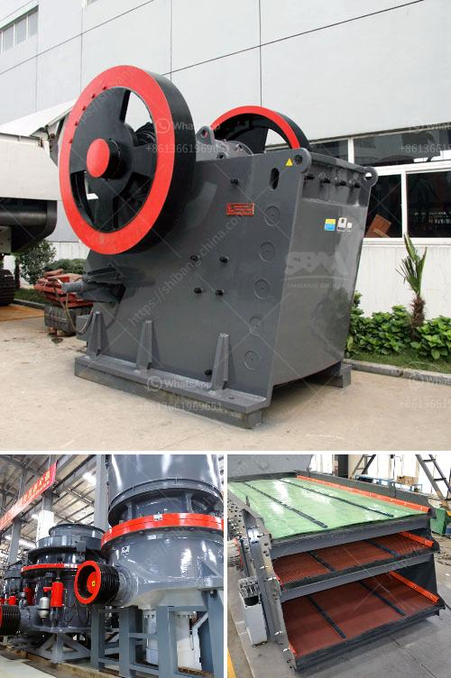

<h3>crusher price in kazakhstan</h3>
The price of crushers in Kazakhstan has been a topic of discussion in recent times. With the country's growing mining and construction industry, the demand for crushers has also increased exponentially. Crushers are essential equipment used for crushing rocks and stones into smaller sizes, which are then used for various purposes like construction, road building, and mining.

One of the factors influencing crusher prices in Kazakhstan is the quality of the equipment. High-quality crushers are built with durable materials and advanced technology, making them more efficient and long-lasting. These crushers tend to have a higher price tag due to their superior performance and reliability. On the other hand, low-quality crushers might have a lower initial cost but may require frequent repairs and replacements, which can be costly in the long run.

Additionally, the type and size of the crusher also play a role in determining its price. There are various types of crushers available in the market, including jaw crushers, cone crushers, impact crushers, and gyratory crushers. Each type serves a specific purpose and has its own advantages and limitations. Larger crushers tend to be more expensive due to their higher processing capacity and power requirements.

The location and availability of the crushers also impact their prices. If a crusher needs to be transported from a distant location, the transportation costs can significantly increase the overall price. Similarly, if there is limited availability of crushers in a particular area, the prices may be higher due to increased demand.

Lastly, market competition also plays a crucial role in determining crusher prices in Kazakhstan. When multiple suppliers offer similar products, they tend to compete by offering competitive prices. As a result, customers can benefit from lower prices due to this competition.

In conclusion, the price of crushers in Kazakhstan is influenced by several factors, including the quality of the equipment, type and size of the crusher, transportation costs, availability, and market competition. It is essential for customers to consider these factors before making a purchase decision, ensuring they acquire a high-quality crusher that meets their specific requirements at a reasonable price.
<h3>Contact us</h3><ul><li><strong>Whatsapp:&nbsp;<a href="https://wa.me/8613661969651">+8613661969651</a></strong></li><li><a href="https://swt.shibang-china.com/?git&amp;zhl&amp;crusher price in kazakhstan"><strong>Online Service(chat now)</strong></a></li></ul><h3>Related</h3><ul><li><a href='stone crusher uganda.md'>stone crusher uganda</a></li><li><a href='crawler type mobile crushers.md'>crawler type mobile crushers</a></li><li><a href='costs of calcium carbonate making machinery in japan.md'>costs of calcium carbonate making machinery in japan</a></li><li><a href='clay brick crusher manufacturers in pakistan.md'>clay brick crusher manufacturers in pakistan</a></li><li><a href='concrete crushing plant in dubai.md'>concrete crushing plant in dubai</a></li></ul>