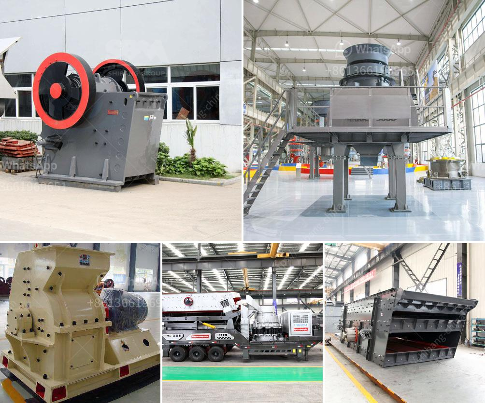

<h3>crusher price jaw crusher prices</h3>
When it comes to buying a crusher, there are lots of factors to consider. One of the most important elements is the price. With so many options available, understanding the jaw crusher prices can help you make the right choice for your crushing needs. In this article, we will dive into the various factors that affect jaw crusher prices.

First and foremost, the brand and reputation of the crusher manufacturer play a significant role in determining the price. Well-established and renowned brands tend to have higher prices compared to relatively new or lesser-known manufacturers. This is primarily because reputable brands have a track record of producing reliable and durable crushers, resulting in higher demand and thus higher prices.

Additionally, the type of jaw crusher you choose will also impact the price. There are various types of jaw crushers available, including primary crushers, secondary crushers, and tertiary crushers. The primary crushers are typically the most expensive, as they are designed to handle large rocks and have higher power requirements. On the other hand, secondary and tertiary crushers are usually cheaper and are used for processing smaller materials.

Another crucial factor influencing the price is the capacity or production output of the jaw crusher. Jaw crushers with higher capacity are generally pricier. This is because higher capacity crushers require more robust construction, larger motors, and specialized components to handle the increased workload. Therefore, it's important to assess your crushing needs and select a jaw crusher with an appropriate capacity to avoid overpaying for unnecessary features.

Furthermore, the features and specifications of the crusher can significantly impact the price. Crushers with advanced features such as hydraulic adjustment, automatic lubrication, and overload protection tend to be more expensive than basic models. These additional features enhance the overall efficiency and convenience of the crusher, making them a preferred choice for many buyers. However, it is essential to assess whether these features are necessary for your specific crushing requirements, as they can contribute to a higher overall cost.

Apart from the basic price of the jaw crusher, there are also other expenses to consider. These include shipping costs, installation fees, and any additional accessories or spare parts needed. It's advisable to inquire about these extra costs upfront to avoid any surprises and include them in your budget when determining the total crusher price.

Lastly, market demand and economic factors can impact the jaw crusher prices. Fluctuations in the price of raw materials, such as steel and labor costs, can influence the manufacturing costs for crushers and ultimately impact the market prices. Therefore, it's essential to stay informed about the market trends and economic conditions to make an informed decision while purchasing a jaw crusher.

In conclusion, understanding the various factors that influence jaw crusher prices is crucial when planning to buy a crusher. Consider the brand reputation, type, capacity, features, and additional costs associated with the crusher. By doing thorough research and weighing these factors, you can find a jaw crusher that meets your needs within your budget.
<h3>Contact us</h3><ul><li><strong>Whatsapp:&nbsp;<a href="https://wa.me/8613661969651">+8613661969651</a></strong></li><li><a href="https://swt.shibang-china.com/?git&amp;zhl&amp;crusher price jaw crusher prices"><strong>Online Service(chat now)</strong></a></li></ul><h3>Related</h3><ul><li><a href='crusher stone crusher de rio stone.md'>crusher stone crusher de rio stone</a></li><li><a href='iron ore processing plant.md'>iron ore processing plant</a></li><li><a href='crushing machines in santa cruz bolivia.md'>crushing machines in santa cruz bolivia</a></li><li><a href='were to buy old rock crusher.md'>were to buy old rock crusher</a></li><li><a href='hammer mill for limestone in south africa.md'>hammer mill for limestone in south africa</a></li></ul>