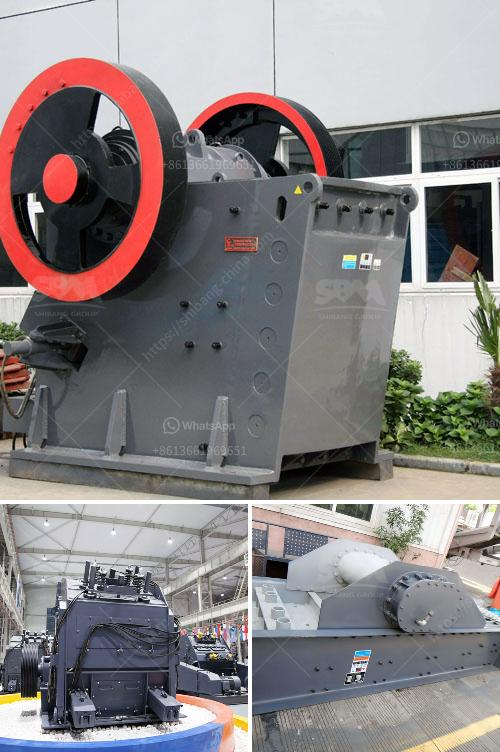

<h3>crusher prices in kenya</h3>
As the backbone of modern construction, crushers are indispensable for breaking down large rocks and stones into smaller pieces for various construction purposes. With the growing demand for infrastructure projects in Kenya, the need for high-quality crushers is paramount. However, understanding the factors influencing crusher prices in Kenya is crucial for potential buyers to make informed decisions.

One of the primary factors determining crusher prices in Kenya is the size of the equipment. Larger crushers tend to be more expensive due to their higher production capacities and enhanced efficiency. For instance, a standard-sized jaw crusher, commonly used in Kenya, typically costs between $10,000 and $50,000. However, larger crushers with higher output capacities can range from $50,000 to $200,000 or more.

The second factor influencing crusher prices is the brand and model. Crushers from well-known and established brands often come with a higher price tag due to their reputation for durability, reliability, and high performance. These brands invest heavily in research and development, which translates into superior technology and construction, commanding a premium price. In contrast, newer and lesser-known brands might offer more affordable options, but potential buyers should carefully evaluate their quality and reliability.

Another aspect to consider when determining crusher prices in Kenya is the type of crusher. There are different types available, each designed for specific applications and materials. Jaw crushers, cone crushers, impact crushers, and hammer crushers are among the most commonly used in Kenya. While jaw crushers are known for their simple structure and easy maintenance, they may not be suitable for all types of materials. Cone crushers, on the other hand, are highly efficient in processing harder and more abrasive materials, but they come with a higher price point due to their advanced technology and mechanism.

In addition to the size, brand, and type of crusher, the pricing also depends on the features and specifications of the equipment. Customizable options, such as adjustable discharge sizes, automatic lubrication systems, and remote control operation, contribute to higher prices. While these features enhance convenience and operational efficiency, buyers should carefully assess their needs and opt for the ones that align with their specific requirements and budget.

Apart from the initial cost, potential buyers should also consider the long-term expenses associated with crushers. Operational costs, including energy consumption, maintenance, and spare parts, can significantly impact the total cost of ownership. Therefore, it is advisable to choose crushers that offer good energy efficiency and are compatible with cost-effective maintenance practices. Furthermore, buyers should inquire about spare-part availability and pricing to ensure future operational continuity without facing exorbitant charges.

In conclusion, when it comes to crusher prices in Kenya, several factors come into play. The size, brand, type, features, and specifications of the equipment, along with long-term expenses, should be carefully considered before making a purchase. While budget constraints are inevitable, compromising on quality or opting for cheaper alternatives may lead to higher maintenance costs and subpar performance in the long run. Therefore, potential buyers should be prudent and conduct thorough research to strike the right balance between cost and quality, ensuring they acquire a crusher that meets their specific needs and delivers optimal value for their investment.
<h3>Contact us</h3><ul><li><strong>Whatsapp:&nbsp;<a href="https://wa.me/8613661969651">+8613661969651</a></strong></li><li><a href="https://swt.shibang-china.com/?git&amp;zhl&amp;crusher prices in kenya"><strong>Online Service(chat now)</strong></a></li></ul><h3>Related</h3><ul><li><a href='dolomite crusher manufacturer in nagpur.md'>dolomite crusher manufacturer in nagpur</a></li><li><a href='andhra pradesh coal crusher equipment price.md'>andhra pradesh coal crusher equipment price</a></li><li><a href='stone crushing plant in saudi.md'>stone crushing plant in saudi</a></li><li><a href='multi hammer crusher.md'>multi hammer crusher</a></li><li><a href='gold ore crushers for sale in india.md'>gold ore crushers for sale in india</a></li></ul>