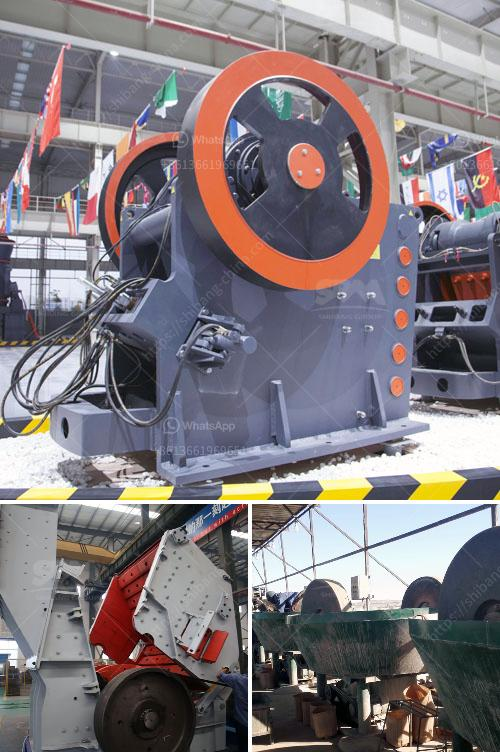

<h3>crusher prices of mobile crusher in bolivia</h3>
In recent years, with the rapid development of Bolivia's economy and the mining industry, the country is rich in mineral resources. The high demand for mobile crushers drives the development of the crushing industry. There are many crusher manufacturers in Bolivia, but the prices of mobile crushers vary widely.

The price of mobile crushers in Bolivia is influenced by multiple factors, including the production cost, market competition, and the level of economic development in Bolivia. Although the mobile crushing equipment market has certain price competition, the prices of different manufacturers still vary. In order to increase the competitiveness of the equipment, manufacturers will adopt different pricing strategies based on their own advantages and the needs of customers.

Firstly, the production cost of mobile crushers varies depending on the materials, technology, and production process used by each manufacturer. The production cost directly affects the price of the mobile crusher. Manufacturers with advanced technology and efficient production processes generally have higher production costs, which will lead to higher prices of the equipment.

Secondly, the market competition is also an important factor affecting the price of mobile crushers. With the continuous development of Bolivia's economy, more and more companies are entering the mobile crusher market. The increasing number of competitors will lead to more intense price competition. Manufacturers will reduce their prices to attract customers, resulting in lower average prices for mobile crushers.

Additionally, the level of economic development in Bolivia also affects the price of mobile crushers. In regions with higher economic development, the demand for mobile crushers is generally higher, and the price of equipment is also higher. Conversely, in regions with lower economic development, the demand for mobile crushers is relatively lower, and the price of equipment is also relatively lower.

In conclusion, the prices of mobile crushers in Bolivia are influenced by multiple factors, including production costs, market competition, and the level of economic development. Different manufacturers adopt different pricing strategies based on these factors. Customers should carefully compare the prices and performance of different mobile crushers to choose a suitable and cost-effective equipment.
<h3>Contact us</h3><ul><li><strong>Whatsapp:&nbsp;<a href="https://wa.me/8613661969651">+8613661969651</a></strong></li><li><a href="https://swt.shibang-china.com/?git&amp;zhl&amp;crusher prices of mobile crusher in bolivia"><strong>Online Service(chat now)</strong></a></li></ul><h3>Related</h3><ul><li><a href='granite crushers for sale.md'>granite crushers for sale</a></li><li><a href='hammer mill crusher batubara.md'>hammer mill crusher batubara</a></li><li><a href='feldspar quarry processing plant.md'>feldspar quarry processing plant</a></li><li><a href='china jaw crusher importer in pakistan.md'>china jaw crusher importer in pakistan</a></li><li><a href='high efficiency manganese ore raymond mill in india.md'>high efficiency manganese ore raymond mill in india</a></li></ul>