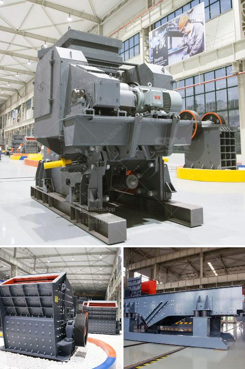

<h3>crusher repairs south africa</h3>
Crushers are machines used to reduce the size of rocks and stones in the mining, quarrying, and construction industries. Over time, these powerful pieces of equipment undergo wear and tear due to constant use. As a result, crusher repairs become a necessary part of maintaining this machinery's efficiency.

In South Africa, crusher repairs are on the rise due to the high demand for crushing and screening equipment. However, many owners and operators find it challenging to source reputable crusher repair specialists. To address this issue, industry-leading service providers are stepping up to offer comprehensive repair solutions, ensuring equipment operates at optimal levels.

Crushers are vital to various industries, including mining, where they serve to crush bulk materials extracted from the earth. Additionally, they play a critical role in the construction sector by breaking down large stones into pieces suitable for further processing or use as building materials. As such, crusher repairs are necessary to ensure these machines remain operational, preventing downtime that can lead to significant financial losses for companies.

1. Inspection and diagnostics: Qualified specialists conduct a thorough inspection to identify potential issues or areas in need of repair. This process often involves conducting tests to determine the specific problem affecting the crusher's performance.

2. Parts replacement: Depending on the findings from the inspection, components may need to be replaced to restore the crusher's functionality. Reputable repair specialists source high-quality parts to ensure optimal equipment performance and extended lifespan.

3. Routine maintenance: Regular maintenance is crucial for the long-term efficiency of crushers. Maintenance tasks may include lubrication, cleaning, and checks on specific parts or systems to identify any signs of wear or potential issues.

4. Emergency repairs: Equipment breakdowns can happen at any time, causing delays and disrupting operations. Reliable repair services offer emergency response and on-site repairs to get machines up and running promptly.

When seeking crusher repair services in South Africa, it is essential to consider a few factors to ensure you choose a reputable and reliable specialist:

1. Expertise: Look for a repair specialist with a proven track record of servicing crushers in your industry. Experience and knowledge in handling various types and models of crushers are essential.

2. Quality parts: Ensure the service provider uses high-quality parts that meet industry standards. This ensures the longevity and efficiency of your equipment.

3. Customer service: Good communication, on-time delivery, and efficient service are vital indicators of a reliable crusher repair specialist.

In conclusion, crusher repairs are essential for maintaining the efficiency and functionality of equipment used in the mining, quarrying, and construction industries. With the increasing demand for these services in South Africa, it is crucial to choose a reputable repair specialist with the necessary expertise, quality parts, and excellent customer service. By doing so, companies can ensure their crushers operate optimally, reducing downtime and maximizing productivity.
<h3>Contact us</h3><ul><li><strong>Whatsapp:&nbsp;<a href="https://wa.me/8613661969651">+8613661969651</a></strong></li><li><a href="https://swt.shibang-china.com/?git&amp;zhl&amp;crusher repairs south africa"><strong>Online Service(chat now)</strong></a></li></ul><h3>Related</h3><ul><li><a href='stone crusher plant philippines.md'>stone crusher plant philippines</a></li><li><a href='grizzly coal mining equipment.md'>grizzly coal mining equipment</a></li><li><a href='granite stone crusher india.md'>granite stone crusher india</a></li><li><a href='river rock crushing equipment.md'>river rock crushing equipment</a></li><li><a href='buy new bal mill.md'>buy new bal mill</a></li></ul>