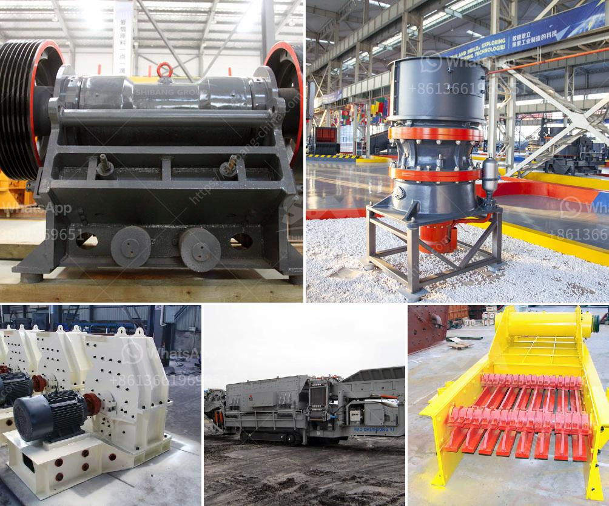

<h3>crusher run for sale in sabah</h3>
Crusher run is a popular material for both commercial and residential projects in Sabah, Malaysia. Whether you need it for road construction, landscaping, or any other purposes, crusher run is a versatile and affordable option. This article will provide an overview of crusher run, the benefits it offers, and where you can find it for sale in Sabah.

Crusher run is a type of aggregate material that is commonly used in construction projects. It is made from a blend of small particles of crushed stone, sand, and clay. These particles are mixed together and compacted to create a solid, durable layer that supports heavy loads. Whether you are building a road, driveway, or building foundation, crusher run is an excellent choice for the base layer.

One of the key benefits of using crusher run is its affordability. Compared to other types of aggregates, such as gravel or crushed stone, crusher run is relatively inexpensive. This makes it an ideal choice for projects with budget constraints. Additionally, crusher run is readily available in Sabah, making it convenient to source and purchase.

Another advantage of crusher run is its excellent compaction properties. When properly compacted, crusher run forms a solid and stable surface that can withstand heavy traffic and weather conditions. It provides a strong foundation that prevents shifting, rutting, or erosion. This makes crusher run suitable for both residential and commercial applications, including driveways, parking lots, and walkways.

In addition to its strength and affordability, crusher run also offers excellent drainage capabilities. The combination of crushed stone, sand, and clay allows water to permeate through the material, preventing water pooling or puddling. This is especially beneficial in Sabah, where heavy rainfall is common. Good drainage helps to maintain the integrity of the pavement, reducing the risk of structural damage.

If you are looking to purchase crusher run in Sabah, there are several places to consider. Local building supply stores and quarries often carry crusher run in various sizes, allowing you to choose the most suitable option for your project. It is advisable to visit multiple suppliers to compare prices and ensure that you are getting the best value for your money. Additionally, you can also inquire about delivery options, as some suppliers offer this service for your convenience.

Before purchasing crusher run, it is important to measure the area you plan to cover. This will help you determine the quantity of crusher run you need for your project. It is recommended to consult with a professional or seek advice from the supplier if you are unsure about the amount required.

In conclusion, crusher run is a versatile and cost-effective material for various construction projects in Sabah. Its affordability, strength, and excellent drainage capabilities make it a popular choice among contractors and homeowners. Whether you are building a road, driveway, or foundation, crusher run is a reliable option that ensures long-lasting results. Take the time to research and compare different suppliers to find the best crusher run for sale in Sabah that meets your specific needs.
<h3>Contact us</h3><ul><li><strong>Whatsapp:&nbsp;<a href="https://wa.me/8613661969651">+8613661969651</a></strong></li><li><a href="https://swt.shibang-china.com/?git&amp;zhl&amp;crusher run for sale in sabah"><strong>Online Service(chat now)</strong></a></li></ul><h3>Related</h3><ul><li><a href='hammer mill bolivia.md'>hammer mill bolivia</a></li><li><a href='calcium carbonate grinding.md'>calcium carbonate grinding</a></li><li><a href='small scale gypsum powder plant.md'>small scale gypsum powder plant</a></li><li><a href='coal crushing plant in pakistan.md'>coal crushing plant in pakistan</a></li><li><a href='gravel crushing plant.md'>gravel crushing plant</a></li></ul>