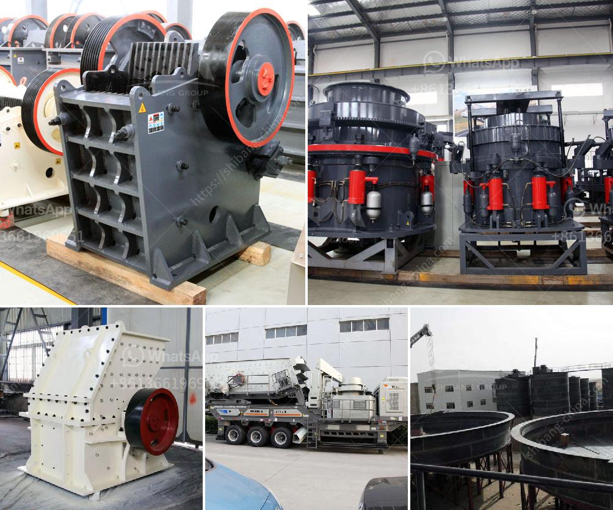

<h3>crusher screening plant</h3>
A crusher screening plant, also known as a crushing and screening plant, is a machine used to separate, classify, and size solid materials. These tools are mainly used in industries like mining, construction, and aggregate production to achieve desired end products efficiently and reliably.

The primary purpose of a crusher screening plant is to reduce the size of raw materials like rock, ore, or gravel to a more manageable and usable form. The process involves feeding the material into the machine's hopper, where it is then conveyed to the primary crusher. The crusher, typically a jaw or impact crusher, breaks down the material into smaller pieces.

After passing through the primary crusher, the material is then screened or sorted using a vibrating screen or mesh. The purpose of screening is to separate the different sizes of the crushed material into various fractions. These fractions can be used for different purposes; for example, larger fractions can be used as road base material, while finer fractions can be used as aggregate in concrete production.

A crusher screening plant consists of several different components that work together to achieve efficient and reliable screening operations. These components include the primary crusher, vibrating screen or mesh, conveyors, and control panels. Some plants also include additional equipment like magnets to remove metal contaminants from the material.

One of the key advantages of using a crusher screening plant is its versatility. These machines can be customized to meet specific requirements and handle a wide range of materials. For example, some plants are designed to handle soft materials like limestone, while others are built to handle harder materials like granite or basalt. This adaptability makes crusher screening plants suitable for various applications in different industries.

Another advantage of using a crusher screening plant is the ability to achieve high production rates. These machines are designed to process large volumes of material quickly and efficiently. By using high-quality components and advanced technology, crusher screening plants can deliver consistent and reliable performance, even in demanding operating conditions.

In conclusion, a crusher screening plant is a versatile and efficient machine used in various industries to separate, classify, and size solid materials. These plants play a crucial role in mining, construction, and aggregate production by reducing the size of raw materials and producing usable fractions. With their adaptability and high production rates, crusher screening plants are essential tools for businesses looking to maximize productivity and meet their material requirements.
<h3>Contact us</h3><ul><li><strong>Whatsapp:&nbsp;<a href="https://wa.me/8613661969651">+8613661969651</a></strong></li><li><a href="https://swt.shibang-china.com/?git&amp;zhl&amp;crusher screening plant"><strong>Online Service(chat now)</strong></a></li></ul><h3>Related</h3><ul><li><a href='mobile stone crusher for sale in philippines.md'>mobile stone crusher for sale in philippines</a></li><li><a href='vertical mill size.md'>vertical mill size</a></li><li><a href='coltan processing plant prices.md'>coltan processing plant prices</a></li><li><a href='jaw crusher machine construction diagram.md'>jaw crusher machine construction diagram</a></li><li><a href='mobile crusher capacity 200 ton per hour.md'>mobile crusher capacity 200 ton per hour</a></li></ul>