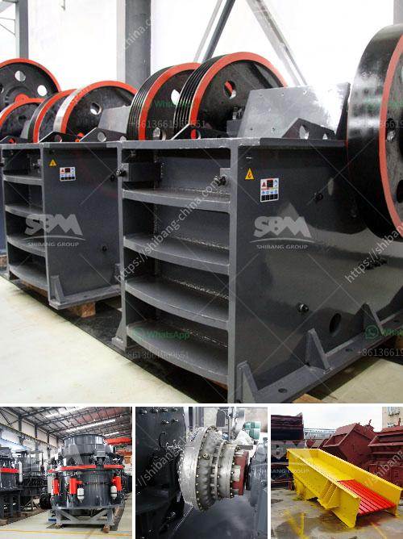

<h3>crusher stone crusher 10x 21 america</h3>
In the mining industry, the use of crushers has revolutionized the way raw materials are extracted and processed. One such revolutionary model is the crusher stone crusher 10x21 America. This state-of-the-art piece of machinery is designed to provide a significant boost to efficiency and productivity in the mining sector.

With its compact size and powerful performance, the crusher stone crusher 10x21 America is setting new benchmarks for crushing equipment. Equipped with a 10x21-inch jaw crusher and a powerful 15 HP electric motor, this portable machine can effortlessly handle a wide range of materials, making it the ideal choice for various mining operations.

What sets the crusher stone crusher 10x21 America apart from its competitors is its ability to deliver consistent and high-quality output. The jaw crusher is specifically designed to crush stones and rocks of varying sizes, ensuring that the end product meets the exact specifications required by the mining industry. This not only saves time but also reduces wastage, ultimately improving the profitability of mining operations.

The crusher stone crusher 10x21 America also boasts a user-friendly interface, making it easy to operate and maintain. Its robust construction ensures durability and longevity, ensuring that it can withstand the harsh conditions often found in mining environments. Additionally, its compact size allows for easy transportation, enabling mining companies to deploy it quickly and efficiently in different locations.

The crusher stone crusher 10x21 America has already made a significant impact on the mining industry, garnering praise and positive feedback from industry experts. With its innovative design and powerful performance, it has redefined the standards for crushing equipment.

As we move into the future, the crusher stone crusher 10x21 America is expected to continue playing a pivotal role in the mining sector. Its ability to enhance productivity, reduce wastage, and deliver consistent results will undoubtedly make it a favored choice among mining companies worldwide.

In conclusion, the crusher stone crusher 10x21 America is a game-changer in the mining industry. Its compact size, powerful performance, and user-friendly interface make it a valuable asset for any mining operation. With its ability to deliver high-quality output and withstand harsh conditions, it is poised to revolutionize the way raw materials are extracted and processed.
<h3>Contact us</h3><ul><li><strong>Whatsapp:&nbsp;<a href="https://wa.me/8613661969651">+8613661969651</a></strong></li><li><a href="https://swt.shibang-china.com/?git&amp;zhl&amp;crusher stone crusher 10x 21 america"><strong>Online Service(chat now)</strong></a></li></ul><h3>Related</h3><ul><li><a href='quartz stone crusher plants made in turkey.md'>quartz stone crusher plants made in turkey</a></li><li><a href='sell crusher of jaw in peru.md'>sell crusher of jaw in peru</a></li><li><a href='frac sand mine feasibility study.md'>frac sand mine feasibility study</a></li><li><a href='crushing plant tenova.md'>crushing plant tenova</a></li><li><a href='south africa jaw crushers.md'>south africa jaw crushers</a></li></ul>