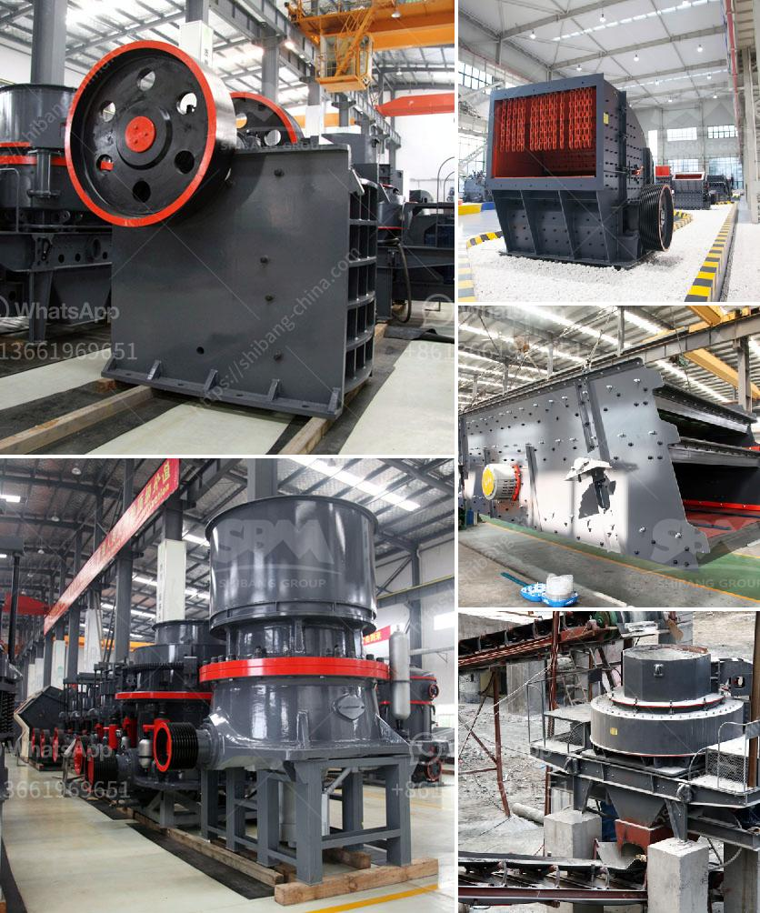

<h3>crusher stone crusher 10x20</h3>
Crusher machines are used for crushing of various kind of materials like iron ore, coke, coal, stone, dolomite, limestone, gypsum, pyrites, copper ore, granite, basalt, gravel, coal gangue and construction waste. It is located in Zhengzhou, Henan Province, China.

One of the leading crusher machine manufacturers, Stone Crusher, offers a wide range of machines that can be customized as per the requirements of customers. These machines are designed to meet the various needs of construction, mining, metallurgy, and other industries.

The Stone Crusher 10x20 is a prime example of a machine that can be customized to meet the specific needs of the customers. This machine is a perfect blend of its modern design, robust structure, and maximum output efficiency. It is equipped with a powerful motor that can produce high-quality crushed stones.

One of the key features of the Stone Crusher 10x20 is its capacity to produce high-quality stones. With a maximum output capacity of 20 tons per hour, this machine can meet the demands of large-scale construction projects. Whether it is for road construction, building construction, or landscaping purposes, this machine can deliver the required crushed stones in a short period of time.

Another significant feature of this machine is its durability. Made from high-quality materials and equipped with advanced technology, the Stone Crusher 10x20 can withstand heavy-duty operations and extreme weather conditions. It is designed to last long and minimize downtime, ensuring maximum productivity for the customers.

The Stone Crusher 10x20 also offers easy operation and maintenance. It is equipped with a user-friendly control panel that allows operators to adjust the settings as per their requirements. Moreover, it requires minimal maintenance, reducing additional costs for the customers.

In terms of safety, the Stone Crusher 10x20 is designed with utmost consideration. It is equipped with advanced safety features like emergency stop buttons, protective covers, and safety guards. This ensures the safety of the operators and prevents accidents in the workplace.

Furthermore, the Stone Crusher 10x20 is designed to be environment-friendly. It is equipped with a dust suppression system that minimizes the release of dust particles during the crushing process. This helps in maintaining a clean and healthy working environment.

In conclusion, the Stone Crusher 10x20 is a reliable and efficient machine that offers high-quality crushed stones. It is designed to meet the specific needs of the customers, whether it is for construction, mining, or any other industry. With its durable structure, easy operation, and maintenance, and advanced safety features, this machine ensures maximum productivity and safety in the workplace. So, if you are looking for a dependable crushing machine to meet your requirements, the Stone Crusher 10x20 is definitely a great choice.
<h3>Contact us</h3><ul><li><strong>Whatsapp:&nbsp;<a href="https://wa.me/8613661969651">+8613661969651</a></strong></li><li><a href="https://swt.shibang-china.com/?git&amp;zhl&amp;crusher stone crusher 10x20"><strong>Online Service(chat now)</strong></a></li></ul><h3>Related</h3><ul><li><a href='difference between css or oss crusher.md'>difference between css or oss crusher</a></li><li><a href='basalt crushing plant.md'>basalt crushing plant</a></li><li><a href='100tph stone crushing and screening plant.md'>100tph stone crushing and screening plant</a></li><li><a href='3 raymond roller mill.md'>3 raymond roller mill</a></li><li><a href='coal crusher machine rental price.md'>coal crusher machine rental price</a></li></ul>