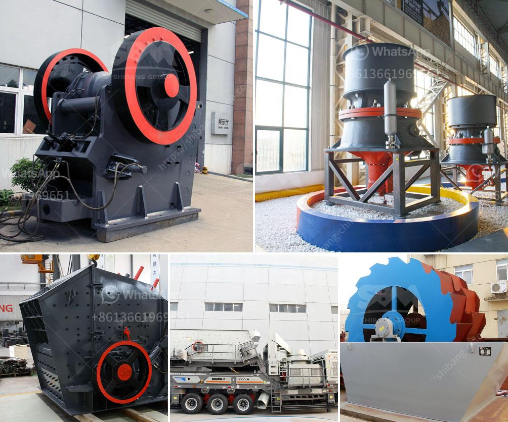

<h3>crusher stone crusher de rio stone</h3>
In the construction industry, stone has always been highly valued for its durability and aesthetic appeal. However, not all types of stone are suitable for construction purposes. Rio stone, also known as river rock or river stone, is a type of naturally occurring stone that requires additional processing to make it suitable for various construction applications. This is where crusher stone comes into play.

Crusher stone refers to the materials produced from the mechanical crushing of rio stone. The process involves using heavy machinery to reduce large rocks into smaller pieces, which are then further processed to create materials that can be used for construction projects.

One of the primary uses of crusher stone is as a base or sub-base material for roads, parking lots, and driveways. Its excellent compaction properties make it an ideal choice for creating a stable foundation that can withstand heavy loads and prevent shifting or settling. Additionally, crusher stone helps with drainage by allowing water to flow freely, reducing the risk of water pooling and potential damage.

Crusher stone is also widely used in the production of concrete. When mixed with cement, sand, and water, it forms a strong and durable mixture that can be molded into various shapes. Whether it's for building foundations, walls, or even decorative elements, crusher stone-infused concrete provides the necessary strength and stability for such applications.

Furthermore, crusher stone can be used for landscaping purposes. Its natural appearance and various sizes give landscapers the flexibility to create visually appealing designs, such as rock gardens, pathways, or retaining walls. The versatility of crusher stone allows for endless possibilities in enhancing the overall aesthetics of outdoor spaces.

Another advantage of crusher stone is its eco-friendly nature. By utilizing rio stone that is abundantly available in riverbeds, quarries can minimize the environmental impact of extracting materials from other sources. Additionally, the crushing process does not involve the use of harmful chemicals or excessive energy consumption, making it a sustainable choice for construction projects.

It is essential to note that crusher stone comes in different sizes, ranging from large boulders to smaller gravel-like particles. The choice of crusher stone size depends on the specific requirements of the project. While larger stones provide stability and strength, smaller ones are commonly used for finer details and surface finishes.

In conclusion, crusher stone plays a vital role in transforming rio stone into valuable construction materials. With its numerous applications and benefits, it has become a go-to choice for builders, landscapers, and architects alike. Its ability to provide stability, durability, and aesthetic appeal make it an indispensable component in various construction projects. As the demand for sustainable building materials continues to rise, crusher stone remains a reliable and eco-friendly option for the construction industry.
<h3>Contact us</h3><ul><li><strong>Whatsapp:&nbsp;<a href="https://wa.me/8613661969651">+8613661969651</a></strong></li><li><a href="https://swt.shibang-china.com/?git&amp;zhl&amp;crusher stone crusher de rio stone"><strong>Online Service(chat now)</strong></a></li></ul><h3>Related</h3><ul><li><a href='advantages and disadvantages of ball mill grinding.md'>advantages and disadvantages of ball mill grinding</a></li><li><a href='crushers plant price.md'>crushers plant price</a></li><li><a href='hammer grinder machine price.md'>hammer grinder machine price</a></li><li><a href='making of calcium carbonate calcite powder.md'>making of calcium carbonate calcite powder</a></li><li><a href='track impact crusher.md'>track impact crusher</a></li></ul>