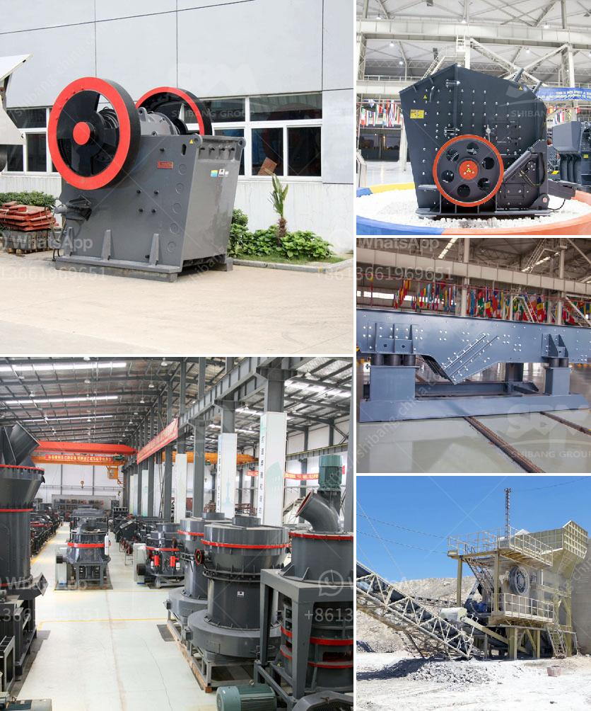

<h3>crusher stone manufacture from china</h3>
Crusher stones, also known as construction aggregates, are an essential material for any construction project. They are primarily used as a base material for roads, foundations, and buildings, as well as for drainage systems and landscaping purposes. With China emerging as a global manufacturing hub, it comes as no surprise that the country is also a leading producer of high-quality crusher stones.

China has been known for its expertise in manufacturing a wide range of construction materials, including crusher stones. The country's rich natural resources, advanced manufacturing capabilities, and competitive pricing have made it a go-to destination for many construction companies worldwide.

One of the key factors contributing to China's success in crusher stone manufacturing is its abundant reserves of raw materials. China possesses large deposits of high-quality rock, making it easier and more cost-effective to produce crusher stones. These reserves ensure a consistent and reliable supply of raw materials, which translates to a constant production of quality crusher stones.

Another significant advantage of crusher stone manufacture from China is the country's advanced manufacturing capabilities. Chinese companies have access to state-of-the-art machinery and equipment that allow them to produce crusher stones with precision and efficiency. These modern manufacturing facilities, combined with skilled craftsmanship, ensure that the end product meets international quality standards.

Furthermore, Chinese manufacturers understand the importance of quality control and adhere to stringent quality assurance measures throughout the manufacturing process. This commitment to quality ensures that the crusher stones produced in China are durable, reliable, and able to withstand the demands of various construction projects.

In addition to high-quality products, the cost-effectiveness of crusher stones manufactured in China is also a noteworthy aspect. Due to the competitive nature of the Chinese market, manufacturers strive to offer products at competitive prices without compromising on quality. This cost advantage makes Chinese crusher stones an attractive option for construction companies looking for budget-friendly solutions.

Moreover, China's well-developed logistics infrastructure enables efficient transportation of crusher stones to different parts of the world. With an extensive road and rail network, as well as access to major seaports, Chinese manufacturers can easily ship their products to customers globally. This streamlined logistical support ensures timely delivery of crusher stones to construction sites, regardless of their location.

As construction projects continue to rise globally, the demand for crusher stones manufactured in China is expected to remain strong. Chinese manufacturers have proven their ability to meet this demand by consistently delivering high-quality, cost-effective products.

In conclusion, China is a leading producer of crusher stones, offering high-quality products at competitive prices. The country's abundant reserves of raw materials, advanced manufacturing capabilities, rigorous quality control measures, and well-developed logistics infrastructure contribute to its success in this industry. Construction companies around the world can trust crusher stones manufactured in China to meet their project needs effectively and efficiently.
<h3>Contact us</h3><ul><li><strong>Whatsapp:&nbsp;<a href="https://wa.me/8613661969651">+8613661969651</a></strong></li><li><a href="https://swt.shibang-china.com/?git&amp;zhl&amp;crusher stone manufacture from china"><strong>Online Service(chat now)</strong></a></li></ul><h3>Related</h3><ul><li><a href='mineral processing equipment cost.md'>mineral processing equipment cost</a></li><li><a href='mobile crushers qatar.md'>mobile crushers qatar</a></li><li><a href='coal processing plant in philippines.md'>coal processing plant in philippines</a></li><li><a href='mobile stone crusher price south africa.md'>mobile stone crusher price south africa</a></li><li><a href='process for chromium separation from chromite ore.md'>process for chromium separation from chromite ore</a></li></ul>