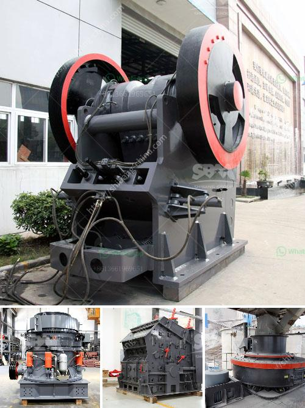

<h3>crusher supplier saudi</h3>
Saudi Arabia, also known as the Kingdom of Saudi Arabia, is one of the largest and most prosperous countries in the Middle East. Renowned for its rich resources, advanced infrastructure, and exceptional industrial growth, the kingdom has created a promising environment for various industries to thrive. Amongst these industries, the construction sector stands out as a significant contributor to the kingdom's economy. This rapid growth has led to an increase in the demand for construction equipment, including crushers, making Crusher Supplier Saudi a crucial player in the industry.

A crusher is a machine designed to reduce large rocks into smaller rocks, gravel, or rock dust. It plays a vital role in the production of concrete, asphalt, and aggregates used in various construction projects. As Saudi Arabia aims to diversify its economy and reduce its dependency on oil, the construction industry is pivotal in driving economic growth and creating job opportunities.

One of the leading crusher suppliers in Saudi Arabia is HSB Trading and Contracting Company. HSB is renowned for its wide range of products and services, including crushing, screening, conveying, drilling, and blasting solutions. With a state-of-the-art infrastructure and a team of highly skilled professionals, HSB has established itself as a reliable and reputable supplier in the kingdom.

HSB's crushers are designed to enhance productivity and efficiency while ensuring optimum safety and environmental standards. They offer a wide range of crushers, including jaw crushers, cone crushers, impact crushers, and VSI crushers. Each crusher is engineered to cater to specific requirements, delivering superior performance and long-lasting durability.

Furthermore, Crusher Supplier Saudi provides comprehensive after-sales services, including maintenance, repair, and spare parts supply. Their commitment to excellent customer support ensures that clients' crushers operate at their peak performance, minimizing downtime and maximizing productivity.

HSB's success as a crusher supplier in Saudi Arabia can be attributed to their unwavering dedication to quality and customer satisfaction. They source their crushers from renowned international manufacturers, ensuring that every product meets the highest industry standards. By continuously investing in research and development, HSB stays at the forefront of technological advancements, offering innovative solutions to meet the evolving needs of the construction industry.

In addition to product quality, HSB also prides itself on competitive pricing and timely delivery. They understand the importance of cost efficiency for their clients and strive to provide the best value for money. HSB's efficient logistics network ensures on-time delivery, supporting their clients' construction projects without delays.

As the construction industry in Saudi Arabia continues to grow, the demand for crushers is expected to rise significantly. Crusher Supplier Saudi, like HSB, will play a crucial role in meeting this demand and supporting the kingdom's infrastructure development. With their exceptional products, commitment to customer satisfaction, and continued focus on innovation, they are poised to lead the market and contribute to the kingdom's thriving construction sector.

In conclusion, the role of a crusher supplier in Saudi Arabia cannot be underestimated. As Saudi Arabia focuses on infrastructure development and economic diversification, crushers play a vital role in the construction industry. HSB Trading and Contracting Company, a leading crusher supplier, stands out for its commitment to quality, customer satisfaction, and innovative solutions. With their extensive range of crushers and comprehensive after-sales services, HSB is well-positioned to meet the increasing demand and contribute to Saudi Arabia's growth and prosperity.
<h3>Contact us</h3><ul><li><strong>Whatsapp:&nbsp;<a href="https://wa.me/8613661969651">+8613661969651</a></strong></li><li><a href="https://swt.shibang-china.com/?git&amp;zhl&amp;crusher supplier saudi"><strong>Online Service(chat now)</strong></a></li></ul><h3>Related</h3><ul><li><a href='eagle 1400 crusher for sale.md'>eagle 1400 crusher for sale</a></li><li><a href='iron ore crushing equipment.md'>iron ore crushing equipment</a></li><li><a href='vibration screen machine.md'>vibration screen machine</a></li><li><a href='set up coal pulverizer plant.md'>set up coal pulverizer plant</a></li><li><a href='dolomite crushing plant price in india.md'>dolomite crushing plant price in india</a></li></ul>