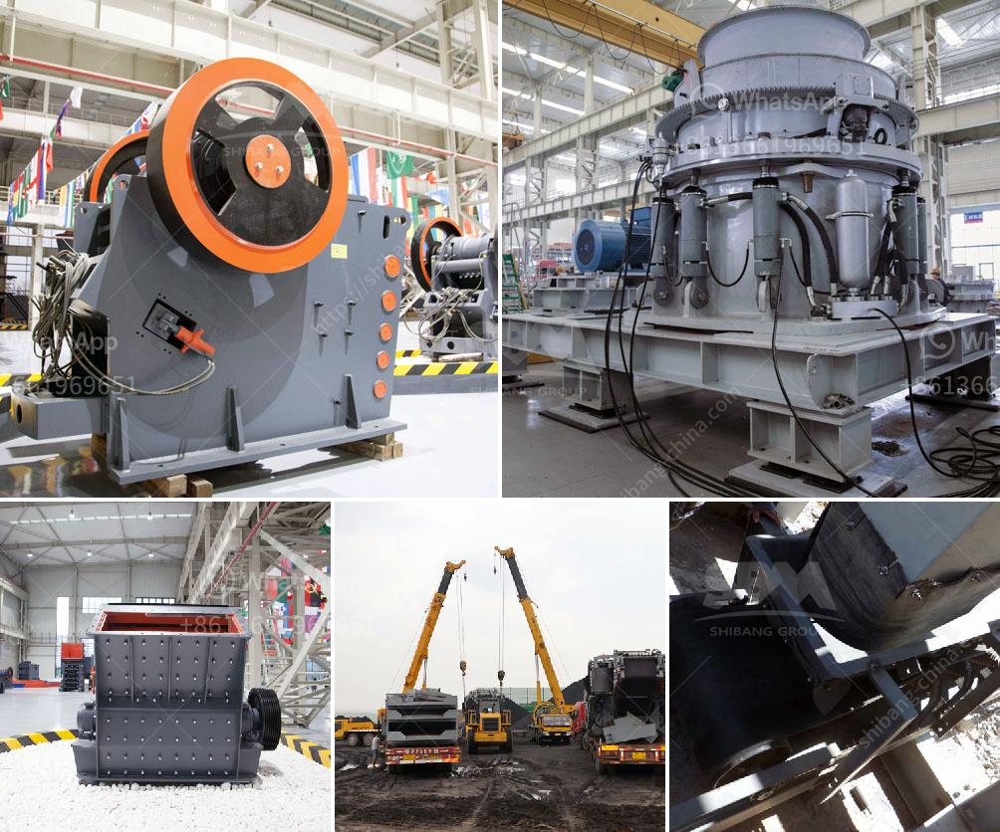

<h3>crushers double toggle</h3>
In the world of aggregate processing, crushers play a pivotal role in reducing large rocks and stones into smaller pieces for further use. Crushers come in various types and models, each designed to suit different crushing applications. One such type is the double toggle crusher, widely recognized for its ability to crush hard and abrasive materials efficiently.

The double toggle crusher, also known as the Blake crusher, is renowned for its ability to toggle between two main crushing motions. In this type of crusher, the swinging jaw plate is suspended on the eccentric shaft, which allows for a larger feed size, consequently improving crushing efficiency.

One of the key advantages of the double toggle crusher is its ability to crush exceptionally abrasive and hard materials. This is achieved by utilizing a higher crushing stroke, resulting in higher forces and pressure being applied to the material. As a result, the double toggle crusher operates at a higher crushing ratio, allowing it to break down rocks and stones into finer particles.

Furthermore, the double toggle crusher is designed with larger crushing chambers compared to its single toggle counterpart. This provides a larger space for material to be fed into the crusher, reducing the risk of clogging and ensuring a consistent feed rate. Additionally, the larger crushing chambers allow for greater nip angles, enhancing the ability to grip and crush materials effectively.

The double toggle crusher is commonly used in mining, quarrying, and recycling industries where the materials being crushed are of varying hardness and abrasiveness. Its sturdy construction and robust design make it ideal for handling the demanding nature of such applications. Whether it is processing hard granite or tough basalt, the double toggle crusher excels in delivering consistent performance.

Additionally, the double toggle crusher offers ease of maintenance. The swinging jaw plate can be easily removed and replaced, reducing downtime and increasing productivity. This feature allows for quick inspection and access to the crusher's internals, facilitating efficient maintenance procedures.

Furthermore, the double toggle crusher is equipped with a hydraulic toggle system, enabling easy adjustment of the crusher's output size. This feature allows operators to optimize the crusher's performance based on specific material requirements and production goals.

In conclusion, the double toggle crusher is an innovative and efficient solution for crushing applications. Its ability to handle abrasive and hard materials, larger crushing chambers, and ease of maintenance make it a preferred choice for various industries. By utilizing the double toggle crusher, operators can achieve higher crushing efficiencies and produce consistently sized output materials.
<h3>Contact us</h3><ul><li><strong>Whatsapp:&nbsp;<a href="https://wa.me/8613661969651">+8613661969651</a></strong></li><li><a href="https://swt.shibang-china.com/?git&amp;zhl&amp;crushers double toggle"><strong>Online Service(chat now)</strong></a></li></ul><h3>Related</h3><ul><li><a href='crawler mobile jaw crusher for sale.md'>crawler mobile jaw crusher for sale</a></li><li><a href='ball mill manufacturers in bangalore.md'>ball mill manufacturers in bangalore</a></li><li><a href='2000 kilos hammer mill.md'>2000 kilos hammer mill</a></li><li><a href='high capacity stone hammer crusher.md'>high capacity stone hammer crusher</a></li><li><a href='jaw crusher for sale in ghana.md'>jaw crusher for sale in ghana</a></li></ul>