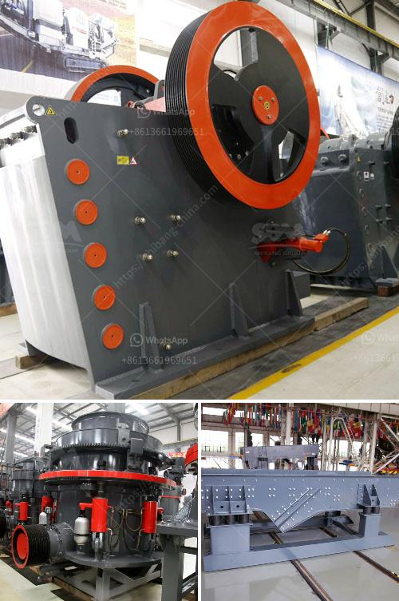

<h3>crushers for granite aggregate</h3>
Granite is a hard and durable rock that is formed from volcanic activity. It is often used as a material for construction and is known for its high compressive strength. This makes it an ideal choice for various applications, including the production of aggregate.

Aggregate is a crucial component in the construction industry. It is a granular material, typically a combination of sand, gravel, crushed stone, or other mineral particles that are mixed with a bonding agent to form concrete or mortar. Granite aggregate, specifically, is popular due to its exceptional strength and durability.

To meet the demand for granite aggregate, crushers play a vital role in the extraction, production, and processing of this material. Crushers are heavy-duty machines designed to break large rocks into smaller fragments or granules. They are commonly used in various industries, including mining, construction, and recycling.

One of the primary types of crushers used in the production of granite aggregate is the jaw crusher. As the name suggests, this design utilizes two plates to crush the material. One plate remains stationary, while the other moves back and forth to deliver the crushing action. Jaw crushers are designed to handle large pieces of rock and are usually the first stage in the crushing process.

Another common type of crusher used for granite aggregate is the cone crusher. Cone crushers crush the material between a stationary and a moving cone. The stationary cone is inverted, trunca+ting the upper cone, which provides crushing action against the stationary concave. Cone crushers are preferred when the aggregate shape and size are important factors as they produce cubical, well-graded aggregates.

Impact crushers are also commonly used in the production of granite aggregate. These crushers use impact force to break the material, resulting in reduced size and better-shaped aggregates. They are suitable for both primary and secondary crushing stages. Impact crushers come in various configurations and can be either horizontal shaft impactors (HSI) or vertical shaft impactors (VSI).

In addition to these primary crushers, screening equipment is often utilized to ensure the desired aggregate size is achieved. Screens separate the crushed granite into various sizes by passing it through different-sized holes, allowing aggregrates of precise dimensions to be produced.

Safety measures are of utmost importance in the operation of crushers for granite aggregate. Proper guarding and regular maintenance ensure that the machines operate efficiently and reduce the risk of accidents. Additionally, using the correct type of crusher for the specific application is vital to maximize productivity and produce high-quality aggregates.

In conclusion, crushers play a pivotal role in the production of granite aggregate. They break down the large rocks into smaller fragments and granules, making it easier to handle, transport, and process. Jaw crushers, cone crushers, and impact crushers are all commonly used for this purpose and can produce high-quality aggregates when operated efficiently and maintained properly. However, selecting the right type of crusher and adhering to safety measures are crucial for optimal results. With the right equipment and practices, the production of granite aggregate can be cost-effective, sustainable, and provide long-lasting construction materials.
<h3>Contact us</h3><ul><li><strong>Whatsapp:&nbsp;<a href="https://wa.me/8613661969651">+8613661969651</a></strong></li><li><a href="https://swt.shibang-china.com/?git&amp;zhl&amp;crushers for granite aggregate"><strong>Online Service(chat now)</strong></a></li></ul><h3>Related</h3><ul><li><a href='quartz stone manufacturing plant.md'>quartz stone manufacturing plant</a></li><li><a href='ball mills for mining.md'>ball mills for mining</a></li><li><a href='sand crusher for sale.md'>sand crusher for sale</a></li><li><a href='sand making crusher machine.md'>sand making crusher machine</a></li><li><a href='ball mill manufacturers gypsum.md'>ball mill manufacturers gypsum</a></li></ul>