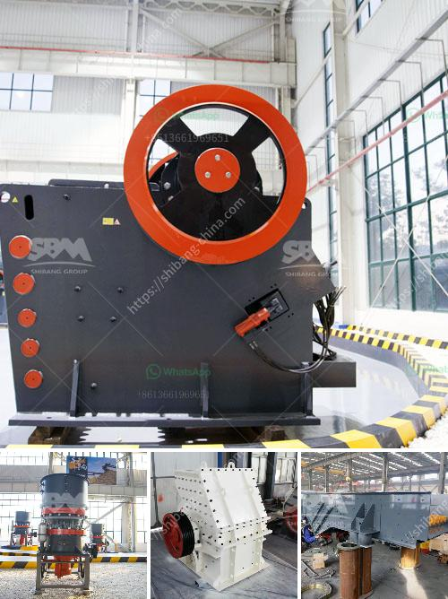

<h3>crushers for hire south africa</h3>
Crushers have the incredible ability to reduce various types of materials to smaller sizes using a combination of mechanical force and sheer brute force. Not only do crushers efficiently break down materials such as limestone, shale, gypsum, phosphate, and other similar materials, they also enable the recycling of demolished concrete and asphalt, resulting in a more eco-friendly approach to construction. South Africa boasts a variety of crushers, which are provided by numerous companies across the country, each specializing in different aspects of the crushing process. Whether you are in the construction industry or simply looking to tackle a DIY project, hiring a crusher can be a cost-effective and convenient solution.

Crusher hire in South Africa is typically a much cheaper option compared to purchasing one outright. Crushers for hire are conveniently located all around the country, offering an accessible way for you to crush and recycle materials. Simply browse the selection, choose the crusher that fits your requirements, and book it for the desired period. This allows you to have access to crushers that are tailored to suit various projects and applications, without the need to invest in expensive machinery.

One of the primary advantages of crusher hire is the convenience it brings. Hiring a crusher eliminates the need for significant transportation costs associated with moving heavy machinery from one location to another. Instead, the crusher is delivered to your designated site, saving you time, energy, and logistical challenges. Additionally, crushers for hire usually come equipped with professionals who are experienced in operating the machinery. This ensures that the crusher is used efficiently and effectively, maximizing its potential and productivity.

Crushers for hire in South Africa provide an array of options to select from in terms of capacity, size, and output. Many contractors and individuals alike are turning to these machines, making it easier than ever before to crush materials in a controlled manner. From smaller compact crushers suitable for residential use, to larger jaw or impact crushers designed for heavy-duty applications, there is a crusher for every project.

The use of crushers for hire in South Africa also enables companies and individuals to contribute to the recycling efforts of the country. By crushing and reusing materials such as concrete and asphalt, you can play a role in reducing waste and conserving resources. This not only promotes sustainable practices but also helps to decrease the demand for new construction materials, reducing the strain on the environment.

Regardless of the size or scale of your project, crushers for hire in South Africa offer a significant advantage in terms of efficiency, convenience, and cost-effectiveness. With a wide range of crushers available for hire, you can select the perfect machine to suit your needs, allowing you to efficiently crush and recycle materials with ease. Whether you are a contractor, homeowner, or DIY enthusiast, crusher hire in South Africa is a reliable and practical solution for your crushing needs.
<h3>Contact us</h3><ul><li><strong>Whatsapp:&nbsp;<a href="https://wa.me/8613661969651">+8613661969651</a></strong></li><li><a href="https://swt.shibang-china.com/?git&amp;zhl&amp;crushers for hire south africa"><strong>Online Service(chat now)</strong></a></li></ul><h3>Related</h3><ul><li><a href='dolomite crusher plant in kuwait.md'>dolomite crusher plant in kuwait</a></li><li><a href='hammer mill sale south africa.md'>hammer mill sale south africa</a></li><li><a href='cost of stone crushing plant.md'>cost of stone crushing plant</a></li><li><a href='mobile stone crusher price south africa.md'>mobile stone crusher price south africa</a></li><li><a href='harga dan tipe stone crusher indonesia.md'>harga dan tipe stone crusher indonesia</a></li></ul>