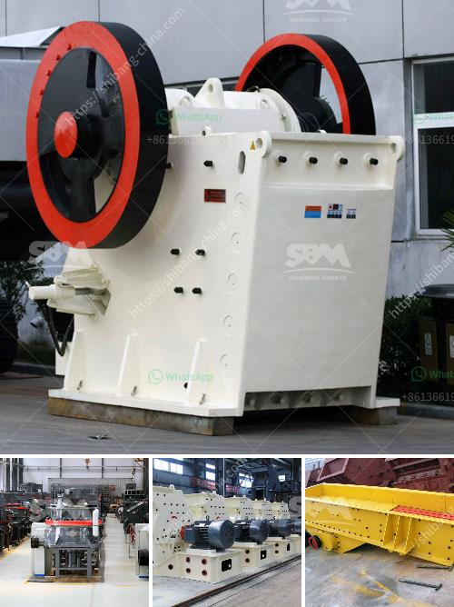

<h3>crushers mobile crushers american mobile</h3>
Crushers, also known as heavy-duty machines, are essential equipment in various industries such as mining, construction, and recycling. Over the years, mobile crushers have gained immense popularity due to their convenience and versatility. Among the leading manufacturers of mobile crushers are American companies that have perfected the art of designing and manufacturing these powerful machines. In this article, we will discuss American mobile crushers and their impact on the industry.

American mobile crushers are known for their robust construction, high productivity, and excellent performance. These machines are designed to crush a wide range of materials, including concrete, asphalt, and rocks. With their ability to process large quantities of material efficiently, they have revolutionized the way industries deal with waste and aggregates.

One of the key advantages of American mobile crushers is their mobility. They are equipped with tracks or wheels, making them easy to transport to different job sites. This mobility allows operators to take the crusher directly to the material source, thereby reducing transportation costs. Additionally, it enables quick setup and dismantling, allowing for faster project completion.

Another notable feature of American mobile crushers is their ability to process various types of materials. They come with different crusher types, including jaw crushers, impact crushers, and cone crushers, each suited for different applications. Jaw crushers are ideal for primary crushing, while impact crushers are effective for secondary and tertiary crushing. Cone crushers, on the other hand, are designed for finer crushing and can produce more cubical-shaped particles.

In terms of performance, American mobile crushers are built to withstand heavy-duty operations. They are equipped with powerful engines and robust crushing chambers, ensuring efficient crushing even of the toughest materials. Furthermore, these crushers often come with advanced features such as remote control, automatic adjustment, and overload protection. These features not only enhance productivity but also ensure operator safety and ease of use.

American mobile crushers also prioritize environmental sustainability. They are designed to minimize dust and noise emissions, making them ideal for urban areas and sensitive environments. Moreover, many crushers are equipped with advanced dust suppression systems, reducing the risks associated with dust inhalation and pollution.

In conclusion, American mobile crushers have revolutionized various industries by offering convenient, versatile, and efficient crushing solutions. Their mobility, ability to process different materials, and robust construction make them indispensable in mining, construction, and recycling applications. With their advanced features and focus on sustainability, these crushers have become a preferred choice for many operators. As technology continues to advance, we can expect American mobile crushers to become even more efficient, safer, and environmentally friendly.
<h3>Contact us</h3><ul><li><strong>Whatsapp:&nbsp;<a href="https://wa.me/8613661969651">+8613661969651</a></strong></li><li><a href="https://swt.shibang-china.com/?git&amp;zhl&amp;crushers mobile crushers american mobile"><strong>Online Service(chat now)</strong></a></li></ul><h3>Related</h3><ul><li><a href='clay brick crusher manufacturers in pakistan.md'>clay brick crusher manufacturers in pakistan</a></li><li><a href='crushers plant price.md'>crushers plant price</a></li><li><a href='feldspar grinding mill.md'>feldspar grinding mill</a></li><li><a href='cement clinker grinding and packing plant.md'>cement clinker grinding and packing plant</a></li><li><a href='out used stone crusher in america.md'>out used stone crusher in america</a></li></ul>