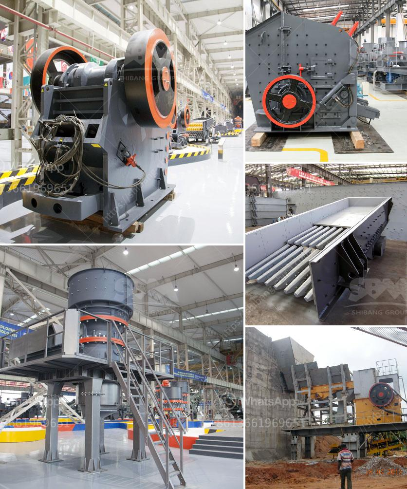

<h3>crushers plant price</h3>
Crushers play a crucial role in the mining and construction industries. They break down larger rocks and stones into more manageable sizes, allowing for easier processing and transportation. However, the cost of setting up a crusher plant can be significant, making it crucial to consider various factors, including the plant price.

The price of crushers plants can vary depending on several factors. Firstly, the type of crusher plays a major role in determining the cost. Different crushers are designed for different materials and applications, such as jaw crushers for primary crushing and cone crushers for secondary or tertiary crushing. Each type comes with its own price point, depending on the specifications and quality.

Additionally, the size and capacity of the plant are important considerations. A larger plant with higher production capacity will generally come at a higher price than a smaller one. It is essential to evaluate your specific crushing needs and determine the appropriate size and capacity accordingly.

Another crucial factor impacting the price is the brand and reputation of the crusher manufacturer. Well-established brands may offer higher-quality products, resulting in more expensive plant prices. However, it is important to assess the quality and reliability of the equipment, as a poorly constructed plant may lead to additional maintenance costs and decreased efficiency in the long run.

Comparing prices and features from different manufacturers is advisable to get the best value for your investment. By analyzing different options, you can find a crushers plant that meets your needs while ensuring reasonable pricing.

While considering the plant price, it is important to remember that the overall cost of setting up a crusher plant goes beyond the initial investment. Factors such as installation, operation, and maintenance expenses can impact the total cost. Therefore, it is essential to assess the long-term affordability and return on investment of the plant.

In conclusion, crushers plants are paramount in the mining and construction industries. The plant price should be carefully evaluated along with factors such as the type, size, and capacity of the plant, as well as the reputation of the manufacturer. By considering all these aspects, you can find a cost-effective solution that meets your crushing requirements without compromising on quality and efficiency.
<h3>Contact us</h3><ul><li><strong>Whatsapp:&nbsp;<a href="https://wa.me/8613661969651">+8613661969651</a></strong></li><li><a href="https://swt.shibang-china.com/?git&amp;zhl&amp;crushers plant price"><strong>Online Service(chat now)</strong></a></li></ul><h3>Related</h3><ul><li><a href='barite grinding processing plant for sale.md'>barite grinding processing plant for sale</a></li><li><a href='hammer mill in japan.md'>hammer mill in japan</a></li><li><a href='jaw crusher for hire south africa for limestone.md'>jaw crusher for hire south africa for limestone</a></li><li><a href='calculation coal crusher.md'>calculation coal crusher</a></li><li><a href='difference between vsi and sand making machine.md'>difference between vsi and sand making machine</a></li></ul>