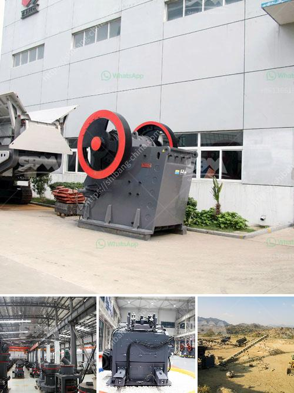

<h3>crushers south africa</h3>
South Africa, with its vast mineral wealth, has been a key player in the mining industry for more than a century. Over the years, the country has been a major producer of various minerals, including gold, platinum, coal, diamonds, manganese, and iron ore. With the country facing steady economic decline in recent years, the mining sector is seen as a crucial driver of economic recovery. As a result, the development of crushers in South Africa has become a key focus for industry players.

In order to revitalize the mining industry and attract much-needed foreign investment, South Africa needs to diversify its mineral base and streamline its operations. Crushers, as the name suggests, are machines that reduce large rocks into smaller pieces. They play an important role in the mining sector by facilitating the extraction and processing of minerals.

South Africa is rich in abundant mineral resources, providing a solid foundation for the country's economic prosperity. Unfortunately, much of this wealth is buried deep beneath the ground, and it becomes increasingly costly to extract as depth increases. This is where crushers come into play, turning the mining process into a cost-effective operation.

There are various types of crushers used in the mining industry. These include jaw crushers, gyratory crushers, cone crushers, and impact crushers. Among these, jaw crushers are the most commonly used in the mining sector due to their ability to crush various materials of different sizes.

The introduction of crushers in the mining industry has significantly improved efficiency and safety when extracting and processing minerals. These machines can reduce large rocks into smaller, more manageable sizes, allowing for easier transportation and further processing. Crushers also have the potential to increase the recovery rate of valuable minerals and reduce wastage.

The development and usage of crushers in South Africa are not only driving the revitalization of the mining industry but also contributing to economic growth. As the mining sector recovers, it creates employment opportunities, stimulates downstream industries, and attracts foreign investment. With the country facing high unemployment rates, the growth of the mining industry is seen as a potential solution to address this issue.

Sustainable mining practices have become paramount in the global mining industry. Crushers also play a significant role in meeting modern environmental standards. The use of crushers allows for the extraction and processing of minerals with minimal carbon emissions and reduced environmental impact compared to traditional mining methods.

The development and adoption of crushers in South Africa's mining industry are vital for economic recovery and sustainable growth. By streamlining operations, reducing costs, increasing mineral recovery, and adhering to environmental standards, crushers are helping to unlock the potential for growth in the country's mining sector. With continued investment in research, development, and infrastructure, South Africa can further leverage its vast mineral resources to drive economic prosperity in the years to come.
<h3>Contact us</h3><ul><li><strong>Whatsapp:&nbsp;<a href="https://wa.me/8613661969651">+8613661969651</a></strong></li><li><a href="https://swt.shibang-china.com/?git&amp;zhl&amp;crushers south africa"><strong>Online Service(chat now)</strong></a></li></ul><h3>Related</h3><ul><li><a href='crusher price in kazakhstan.md'>crusher price in kazakhstan</a></li><li><a href='grinding mill machine.md'>grinding mill machine</a></li><li><a href='limestone processing plant price list.md'>limestone processing plant price list</a></li><li><a href='ball mill for powder.md'>ball mill for powder</a></li><li><a href='silica sand mines in philippines.md'>silica sand mines in philippines</a></li></ul>