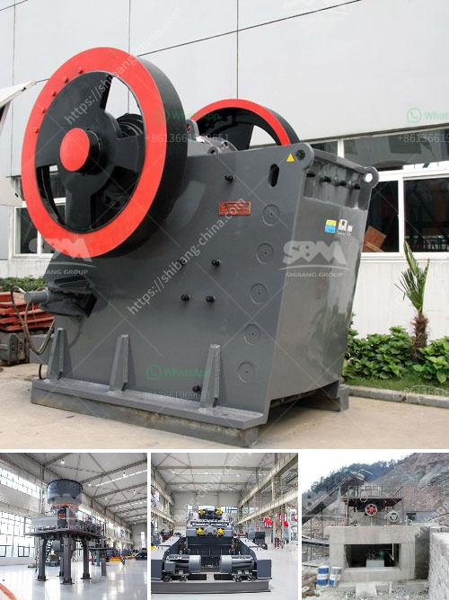

<h3>crushing and screening equipment prices south africa</h3>
Crushing and screening equipment play a vital role in the construction industry because they provide the essential aggregates required for the construction tasks. However, buying new crushing and screening equipment is not always a feasible option, especially for small and medium-sized construction companies. South Africa, being one of the leading countries in the African continent with its thriving construction industry, faces the same dilemma when it comes to crushing and screening equipment prices.

The cost of crushing and screening equipment in South Africa varies greatly depending on several factors, such as the type of machinery, the specific requirements of the project, and the geographical location. Generally, speaking, prices in South Africa are relatively lower compared to other countries in the world due to the country's competitive market.

One of the main factors that determine the price of crushing and screening equipment in South Africa is the exchange rate. Due to the depreciation of the South African Rand against major currencies, such as the US dollar and the Euro, foreign brands of equipment become more expensive. This drives up the prices of imported equipment, making it unaffordable for many construction companies.

Another factor influencing the prices of crushing and screening equipment is the availability of the machinery in South Africa. If specific equipment is in high demand or short supply, the prices tend to rise. On the other hand, if there is a surplus of certain machinery, prices can be more competitive, allowing construction companies to acquire equipment at a lower cost.

It's worth noting that the cost of crushing and screening equipment can be reduced by considering alternative options, such as renting or buying used equipment. Renting can be a cost-effective solution for short-term projects or for companies that don't want to deal with the maintenance and storage of the equipment. On the other hand, buying used equipment can save a significant amount of money, but it's essential to ensure that the machinery is in good condition and meets the required standards.

To get a clear understanding of the crushing and screening equipment prices in South Africa, it's recommended to consult multiple suppliers and compare their offerings. Some suppliers might offer competitive prices due to their long-standing relationships with equipment manufacturers or by offering discounts for bulk purchases. It's also important to consider the after-sales service and warranty offered by suppliers to ensure the long-term reliability of the machinery.

In conclusion, the prices of crushing and screening equipment in South Africa can vary due to various factors, such as the exchange rate, availability of machinery, and alternative options like renting or buying used equipment. Construction companies should carefully analyze their project requirements and consider different suppliers to make an informed decision that suits their budget and construction needs.
<h3>Contact us</h3><ul><li><strong>Whatsapp:&nbsp;<a href="https://wa.me/8613661969651">+8613661969651</a></strong></li><li><a href="https://swt.shibang-china.com/?git&amp;zhl&amp;crushing and screening equipment prices south africa"><strong>Online Service(chat now)</strong></a></li></ul><h3>Related</h3><ul><li><a href='the cost of grinding machine in uganda.md'>the cost of grinding machine in uganda</a></li><li><a href='impact crusher sale.md'>impact crusher sale</a></li><li><a href='m sand manufacturing machine.md'>m sand manufacturing machine</a></li><li><a href='price for 100 tph impact crusher.md'>price for 100 tph impact crusher</a></li><li><a href='gypsum board manufacturing plant in turkey.md'>gypsum board manufacturing plant in turkey</a></li></ul>