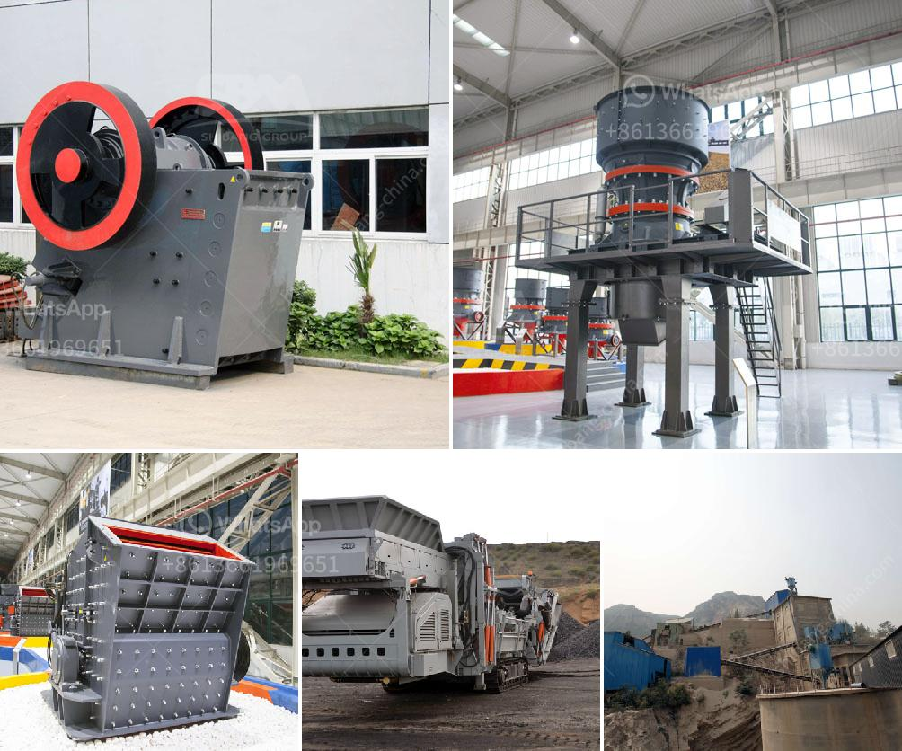

<h3>crushing and screening rustenburg</h3>
Rustenburg, located in the North West Province of South Africa, is home to one of the largest mining operations in the country. The region is renowned for its abundant mineral resources, including platinum, chrome, and gold. As a result, the mining industry plays a crucial role in the local economy.

To extract these valuable minerals, the mining process involves crushing and screening the raw ore-bearing rocks. This critical step in the mining operation ensures that the desired minerals are efficiently separated from the surrounding waste material. The crushing and screening process not only enhances the grade and quality of the mineral products but also ensures the safety and sustainability of the entire operation.

Crushing is the initial stage of extracting minerals from the rock formations. Large rocks are broken down into smaller, more manageable sizes using powerful machinery such as jaw crushers or impact crushers. The goal is to reduce the size of the rocks while maximizing the liberation of the minerals. Optimal rock fragmentation is crucial to subsequent processes, such as grinding and flotation, which further refine the minerals.

After the crushing stage, the material goes through the screening process. Screening involves the separation of various-sized particles using screens or sieves. This step ensures that the desired mineral particles meet specific size requirements. By separating the material into different fractions, crushing and screening allow for the production of various final products, each tailored to specific industrial applications.

Efficiency and productivity are key factors in any mining operation, especially in a region like Rustenburg with its vast mineral reserves. Using cutting-edge crushing and screening technologies, the mining industry in Rustenburg can optimize its processes and achieve these goals effectively.

One such technology that has revolutionized the mining industry is the development of mobile crushing and screening equipment. These mobile units are equipped with advanced features and capabilities, allowing operators to move them from one location to another swiftly. This flexibility is beneficial, particularly in a mining operation as it allows for on-site crushing and screening, minimizing the transportation of raw ore.

Mobile crushing and screening plants are also designed with high performance in mind. They come equipped with powerful crushers, efficient screens, and intelligent control systems that streamline the entire process. This not only results in improved productivity but also reduces energy consumption, leading to cost savings.

Moreover, the modern crushing and screening equipment used in Rustenburg is designed to enhance operator safety. For example, remote-controlled equipment allows operators to control the machinery from a safe distance, minimizing potential risks. Additionally, advanced monitoring systems and sensors provide real-time data on the equipment's performance, alerting operators to potential issues and maintenance requirements.

In conclusion, crushing and screening play a pivotal role in the mining industry, particularly in mineral-rich regions like Rustenburg. By optimizing these processes, mining operations can achieve higher productivity, improved product quality, and enhanced safety. The utilization of innovative technologies, such as mobile crushing and screening equipment, ensures efficient operations that support the sustainable extraction of valuable minerals from the earth. Ultimately, efficient crushing and screening processes contribute to the economic growth and development of Rustenburg's mining industry.
<h3>Contact us</h3><ul><li><strong>Whatsapp:&nbsp;<a href="https://wa.me/8613661969651">+8613661969651</a></strong></li><li><a href="https://swt.shibang-china.com/?git&amp;zhl&amp;crushing and screening rustenburg"><strong>Online Service(chat now)</strong></a></li></ul><h3>Related</h3><ul><li><a href='multi hammer crusher.md'>multi hammer crusher</a></li><li><a href='stone crusher machine price in philippines.md'>stone crusher machine price in philippines</a></li><li><a href='stone crusher plant philippines.md'>stone crusher plant philippines</a></li><li><a href='crush molybdenum equipment.md'>crush molybdenum equipment</a></li><li><a href='coal washing process machine price.md'>coal washing process machine price</a></li></ul>