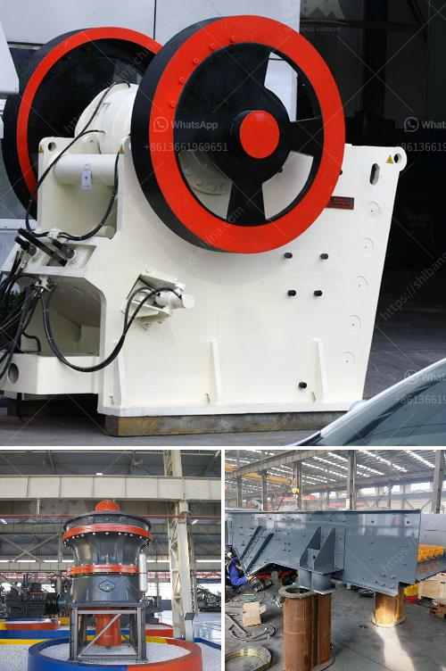

<h3>crushing machine for ceramic raw materials</h3>
Ceramic raw materials have played a crucial role in various industries, such as construction, automotive, and electronics. These materials provide the foundation for countless products, ranging from tiles and sanitaryware to cutting-edge electronic components. To meet the increasing demand for ceramic products, manufacturers have been relying on advanced crushing machines to process the raw materials efficiently.

One key player in the ceramic industry is the crushing machine. This powerful equipment is designed to break down ceramic raw materials into smaller, manageable sizes, facilitating further processing and enhancing the quality of the final product. Whether it is clay, feldspar, quartz, or any other raw material, the crushing machine ensures that the particles are uniform in size and suitable for subsequent manufacturing processes.

The benefits of using a crushing machine for ceramic raw materials are manifold. Firstly, the machine minimizes wastage by ensuring that every bit of raw material is fully utilized. This efficiency is particularly vital considering the finite nature of certain resources used in ceramics. Secondly, the uniformity of particle size achieved by the crushing machine results in consistent product quality. Manufacturers can rely on the machine to deliver materials with the desired specifications, leading to improved production output and customer satisfaction.

Moreover, crushing machines have become increasingly sophisticated in recent years. They are equipped with cutting-edge features such as automated controls, real-time monitoring, and advanced safety systems. These technological advancements not only enhance productivity but also minimize downtime, ensuring that the production process remains smooth and uninterrupted.

In conclusion, the crushing machine for ceramic raw materials has revolutionized the ceramic industry by improving efficiency, reducing wastage, and ensuring consistent product quality. Manufacturers can now rely on these powerful machines to crush and process their raw materials effectively, giving them a competitive edge in the market. As the demand for ceramic products continues to rise, investing in top-of-the-line crushing machines is a wise move for any manufacturer seeking to stay ahead of the curve.
<h3>Contact us</h3><ul><li><strong>Whatsapp:&nbsp;<a href="https://wa.me/8613661969651">+8613661969651</a></strong></li><li><a href="https://swt.shibang-china.com/?git&amp;zhl&amp;crushing machine for ceramic raw materials"><strong>Online Service(chat now)</strong></a></li></ul><h3>Related</h3><ul><li><a href='gypsum crusher supplier in uae.md'>gypsum crusher supplier in uae</a></li><li><a href='manufacturers of mobile crushing plants.md'>manufacturers of mobile crushing plants</a></li><li><a href='hard stone crush maker pakistan.md'>hard stone crush maker pakistan</a></li><li><a href='silica sand quarry for sale in tunisia in cork ireland.md'>silica sand quarry for sale in tunisia in cork ireland</a></li><li><a href='hammer mill for sale south africa.md'>hammer mill for sale south africa</a></li></ul>