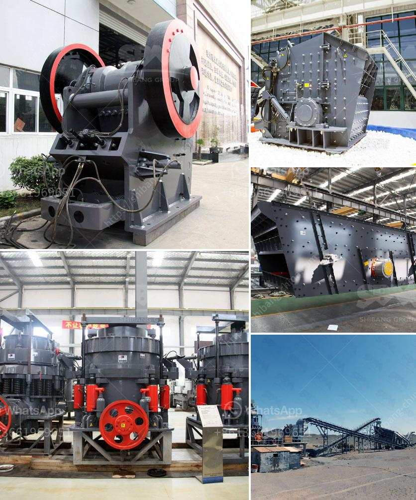

<h3>crushing machines in santa cruz bolivia</h3>
In recent years, the industrial sector in Santa Cruz, Bolivia has experienced a significant transformation with the introduction of advanced crushing machines. These cutting-edge devices have revolutionized the process of breaking down materials, enhancing productivity, and contributing to the economic growth of the region. This article explores the rising popularity and benefits of crushing machines in Santa Cruz, Bolivia.

One of the primary advantages of crushing machines is the remarkable efficiency and productivity they bring to various industries. Traditional methods of material processing often required excessive manpower and time, limiting the output and profitability of companies. However, with the utilization of crushing machines, the process has become faster and more streamlined.

These machines, such as jaw crushers, impact crushers, and cone crushers, can efficiently crush various materials like rocks, minerals, and concrete. With their powerful mechanisms, they break down larger chunks into smaller, more manageable pieces, allowing for easier handling, transportation, and utilization. This improved efficiency has resulted in higher production rates, translating into increased revenue for businesses in Santa Cruz, Bolivia.

Crushing machines have found their niche in a wide variety of industries in Santa Cruz, Bolivia. Construction companies rely on these machines to crush and reuse concrete and rubble as aggregates for new building projects. Mining operations benefit from their ability to crush and process minerals like coal, gold, and iron ore, optimizing extraction processes.

Furthermore, crushing machines have also found applications in the agricultural sector, assisting in the production of animal feed or biomass. This versatility makes these machines invaluable assets across multiple industries, contributing to greater sustainability and resource efficiency in Santa Cruz, Bolivia.

The introduction of crushing machines in Santa Cruz, Bolivia has not only improved industrial processes but has also positively impacted the local economy. As industries invest in these machines to enhance their operations, the demand for skilled technicians and operators has also increased. Consequently, the job market experiences growth, creating employment opportunities and reducing unemployment rates in the region.

Furthermore, the enhanced productivity and efficiency brought by crushing machines have a multiplier effect on the economy. Improved output leads to increased revenue, which can be reinvested in further expansion, research and development, and technological advancements. As a result, Santa Cruz, Bolivia experiences economic growth and becomes a more attractive destination for investors.

Apart from economic benefits, crushing machines in Santa Cruz, Bolivia also contribute to environmental sustainability. The ability to crush and reuse materials reduces the demand for extracting new resources, minimizing environmental degradation caused by such activities. Furthermore, using recycled aggregates reduces waste and helps in mitigating the carbon footprint associated with traditional waste disposal methods.

The utilization of crushing machines in Santa Cruz, Bolivia signifies a revolutionary change in the industrial sector. Enhanced efficiency, diverse applications, job creation, economic impact, and environmental sustainability are some of the key benefits brought by these advanced devices. As businesses continue to embrace this technology, Santa Cruz, Bolivia is poised to experience significant industrial growth and continued economic prosperity.
<h3>Contact us</h3><ul><li><strong>Whatsapp:&nbsp;<a href="https://wa.me/8613661969651">+8613661969651</a></strong></li><li><a href="https://swt.shibang-china.com/?git&amp;zhl&amp;crushing machines in santa cruz bolivia"><strong>Online Service(chat now)</strong></a></li></ul><h3>Related</h3><ul><li><a href='impact crusher design.md'>impact crusher design</a></li><li><a href='copper gold crusher separator.md'>copper gold crusher separator</a></li><li><a href='jual jaw stone advanced bauxite crusher.md'>jual jaw stone advanced bauxite crusher</a></li><li><a href='vertical shaft impact crusher for sale.md'>vertical shaft impact crusher for sale</a></li><li><a href='mining vibrating screen for sale.md'>mining vibrating screen for sale</a></li></ul>