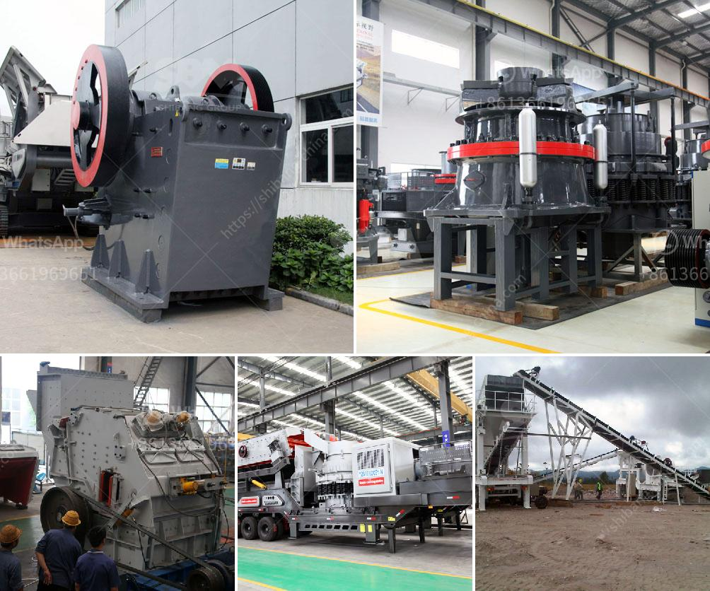

<h3>crushing of gold</h3>
Gold has always remained a valuable and sought-after precious metal throughout history. From ancient civilizations to modern times, it has been synonymous with wealth, power, and luxury. However, before gold can be transformed into sparkling jewelry, coins, or bars, it needs to undergo a meticulous process of crushing or extraction. This article delves into the crushing of gold, explaining the methods, significance, and utilization of this crucial step in the gold production cycle.

The crushing of gold involves various techniques and machinery designed to break down the ore-bearing rocks into smaller fragments, thereby extracting the precious metal trapped within them. Extracting gold from its ore involves a combination of mechanical forces and chemical reactions. Different ores contain varying amounts of gold, and the method of extraction employed depends on the richness and accessibility of the deposit.

Initially, the process begins with prospecting and exploration to identify potential deposits of gold. Once a viable deposit is discovered, mining operations commence. The first step in the crushing process involves drilling and blasting. This is done to loosen and fragment the hard rock, making it easier to extract the gold-containing ore.

After drilling and blasting, the next stage is primary crushing. This entails using heavy-duty machinery such as crushers, which reduce the size of the rocks by applying mechanical force. Typically, the primary crusher used in gold mining operations is a jaw crusher, capable of handling large rocks.

Once the ore has been crushed, it undergoes further processing to separate the gold from the surrounding rock and minerals. This may involve various techniques, such as gravity separation, flotation, or cyanidation. Gravity separation relies on the density difference between gold and the host rock, while flotation uses the surface properties of gold to separate it from other minerals. Cyanidation, on the other hand, involves the use of a weak cyanide solution that dissolves the gold, allowing it to be recovered.

The crushing of gold plays a fundamental role in the gold production cycle. Without this crucial step, extracting gold from its ore would be virtually impossible. Crushing allows miners to liberate gold particles from the surrounding rock, thus increasing its concentration and facilitating subsequent extraction processes.

Furthermore, crushing gold ore is essential for maximizing gold recovery rates. By reducing the size of the ore, it increases the surface area available for chemical reactions, ensuring higher yields of gold. Additionally, this process minimizes the loss of gold particles due to their encapsulation within the host rock.

The crushed gold ore can be further processed to obtain purer gold. It may be subjected to further grinding and refining processes, including smelting and purification. Ultimately, the crushed gold can be transformed into jewelry, bullion, or used for industrial purposes in various sectors like electronics or medicine.

In conclusion, the crushing of gold is a vital step in the gold production cycle. It involves breaking down the ore-bearing rocks to extract the precious metal, facilitating subsequent extraction processes and maximizing gold recovery rates. The significance of this process cannot be understated, as gold holds immense value, both historically and in modern times. From the mines to jewelry stores worldwide, crushing plays a pivotal role in bringing forth the precious metal that captures our fascination and admiration.
<h3>Contact us</h3><ul><li><strong>Whatsapp:&nbsp;<a href="https://wa.me/8613661969651">+8613661969651</a></strong></li><li><a href="https://swt.shibang-china.com/?git&amp;zhl&amp;crushing of gold"><strong>Online Service(chat now)</strong></a></li></ul><h3>Related</h3><ul><li><a href='conveyor belts in france.md'>conveyor belts in france</a></li><li><a href='iron ore crusher plant.md'>iron ore crusher plant</a></li><li><a href='how much investment in bauxite crushing plant.md'>how much investment in bauxite crushing plant</a></li><li><a href='how much cost to build a 50 ton cement plant.md'>how much cost to build a 50 ton cement plant</a></li><li><a href='price for sand machine.md'>price for sand machine</a></li></ul>